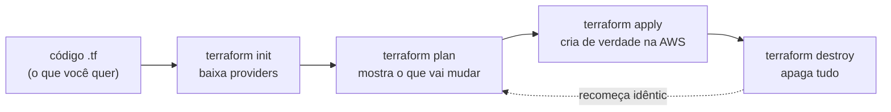
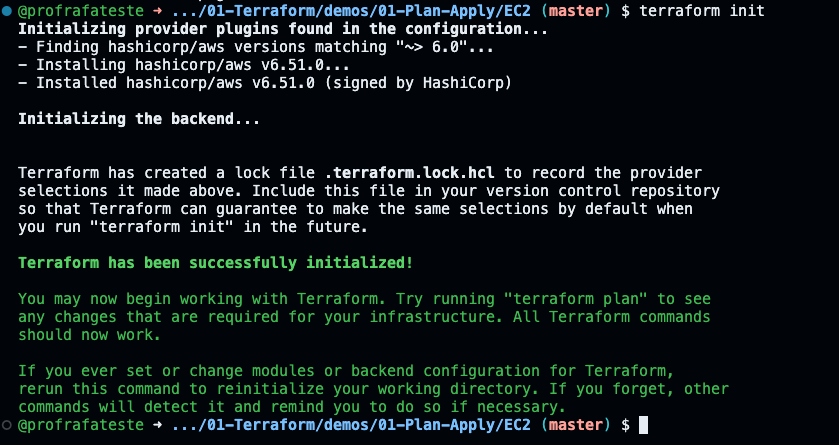
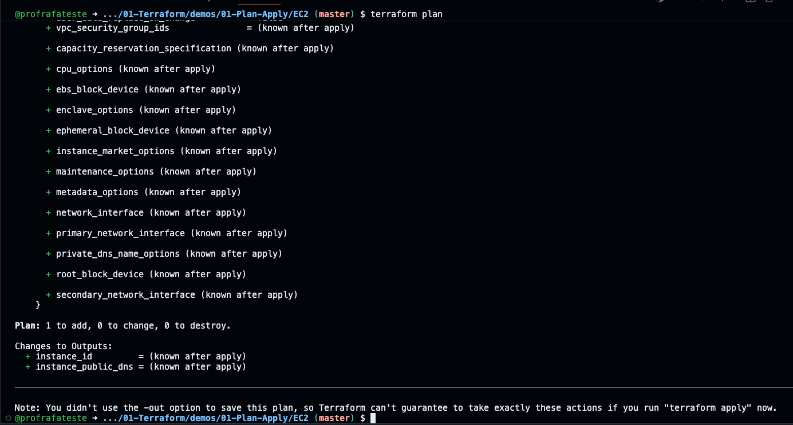
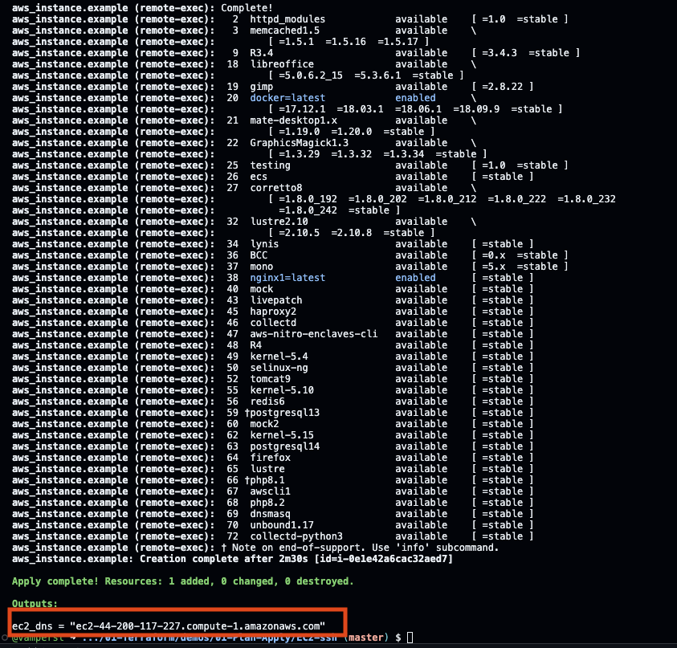

# 01.1 - Plan e Apply: o primeiro recurso da Vortex em código

> **Segunda-feira, 10h. Mês 1 na Vortex Mobility.**
> Helena passou a missão: tirar a infra do "clicado no console" e colocar em código. Você decide começar pequeno e provar o conceito.
>
> > *— "Antes de migrar a frota inteira de servidores, me mostra **uma** máquina nascendo de um arquivo de texto. Quero ver o `plan` dizendo exatamente o que vai criar, o `apply` criando, e o `destroy` apagando — sem ninguém tocar no console."*
>
> Diego, o SRE sênior, passa na sua mesa: *— "É por aqui que todo mundo começa. Se você entender o ciclo `init` → `plan` → `apply` → `destroy`, o resto é detalhe."*

Os comandos `bash` deste lab rodam **no terminal do Codespaces**. As verificações visuais são feitas **no console da AWS** (painel EC2).

> [!WARNING]
> **Pré-requisitos obrigatórios antes de começar:**
>
> - [ ] Credenciais AWS do Academy atualizadas no Codespaces — ver [Preparando Credenciais](../../../00-create-codespaces/Inicio-de-aula.md)
> - [ ] Terraform instalado (`terraform -version` deve responder 1.x)
> - [ ] Par de chaves `vockey` em `/home/vscode/.ssh/vockey.pem` (criado no setup)
> - [ ] Você consegue abrir o [painel EC2](https://us-east-1.console.aws.amazon.com/ec2/home?region=us-east-1#Instances:)
>
> **Valide rapidamente:**
>
> ```bash
> aws sts get-caller-identity && terraform -version
> ```
>
> **O que você vai fazer:** provisionar uma EC2 simples, destruí-la, e depois subir uma EC2 com Nginx acessível pelo navegador. **Tempo estimado: ~30 min** (execução pura ~10 min + tempo para ler, copiar comandos e observar o console da AWS).

Neste laboratório vamos percorrer juntos o ciclo de vida básico do Terraform. Primeiro com o exemplo mais simples possível (uma EC2 sem nada), para focar nos comandos. Depois com um exemplo um pouco mais rico (uma EC2 que se autoconfigura como servidor web), para ver o Terraform conversando com a máquina recém-criada.

## Principais pontos de aprendizagem

- entender o que cada comando do ciclo faz: `init`, `plan`, `apply`, `destroy`
- ler um plano do Terraform e prever o que será criado
- usar um `data source` para descobrir a AMI mais recente dinamicamente
- usar `provisioner` para configurar a máquina após criá-la

## O que você terá ao final

Uma EC2 rodando Nginx, criada e destruída inteiramente por código — **a prova de conceito que Helena pediu** de que a infra da Vortex pode nascer de um arquivo de texto.

> [!TIP]
> Sempre que encontrar um bloco **💡 Clique para entender**, abra-o. Ele aprofunda o comando sem atrapalhar quem só quer seguir o passo a passo.

## Mapa do lab

| Parte | O que você faz | Passos | Tempo |
|-------|----------------|--------|-------|
| [Parte 1](#parte-1---o-ciclo-básico-com-uma-ec2) | O ciclo básico com uma EC2 | [1](#passo-1) · [2](#passo-2) · [3](#passo-3) · [4](#passo-4) · [5](#passo-5) · [6](#passo-6) · [7](#passo-7) · [8](#passo-8) | ~12 min |
| [Parte 2](#parte-2---uma-ec2-que-vira-servidor-web) | Uma EC2 que vira servidor web | [9](#passo-9) · [10](#passo-10) · [11](#passo-11) · [12](#passo-12) · [13](#passo-13) · [14](#passo-14) · [15](#passo-15) · [16](#passo-16) · [17](#passo-17) · [18](#passo-18) | ~18 min |
| [Parte 3](#parte-3---lendo-o-plano-o-que-vai-mudar) | Lendo o plano: o que vai mudar | [19](#passo-19) · [20](#passo-20) · [21](#passo-21) · [22](#passo-22) | ~12 min |
| [Parte 4](#parte-4---drift-quando-alguém-mexe-no-console) | Drift: quando alguém mexe no console | [23](#passo-23) · [24](#passo-24) · [25](#passo-25) · [26](#passo-26) | ~12 min |
| [Parte 5](#parte-5---o-que-o-terraform-sabe-o-estado) | O que o Terraform sabe: o estado | [27](#passo-27) · [28](#passo-28) · [29](#passo-29) | ~8 min |

> [!TIP]
> Se travou em algum passo, clique no número dele na coluna **Passos**.

## Contexto

A Vortex tem dezenas de recursos AWS criados na mão. O problema não é que estejam errados — é que ninguém consegue **reproduzir** o ambiente. Terraform resolve isso descrevendo a infraestrutura como código declarativo: você diz **o que** quer, e a ferramenta calcula **como** chegar lá. O ciclo `init → plan → apply → destroy` é o coração dessa abordagem, e é o que dominaremos aqui.



---

## Parte 1 - O ciclo básico com uma EC2

### Resultado esperado desta parte

Você terá criado e destruído uma instância EC2 inteiramente via Terraform, entendendo cada comando do ciclo.

---

<a id="passo-1"></a>

**1.** No terminal do Codespaces, entre na pasta do exemplo mais simples:

```bash
cd /workspaces/FIAP-Platform-Engineering/01-Terraform/demos/01-Plan-Apply/EC2
```

---

<a id="passo-2"></a>

**2.** Inicialize o diretório de trabalho:

```bash
terraform init
```



<details>
<summary><b>💡 Clique para entender: terraform init</b></summary>
<blockquote>

`terraform init` é o primeiro comando ao iniciar um projeto. Ele prepara o diretório de trabalho:

- **baixa os plugins de provedores** declarados no código (aqui, o `hashicorp/aws ~> 6.0` do `versions.tf`) para a pasta `.terraform/`
- **configura o backend de estado** (local por padrão; nas demos 04 e 05 será remoto no S3)
- **baixa módulos** referenciados, se houver

Se os plugins já estiverem instalados, ele não baixa de novo (a menos que você passe `-upgrade`). Sem rodar `init`, qualquer `plan` ou `apply` falha.

Documentação oficial: [terraform init](https://developer.hashicorp.com/terraform/cli/commands/init)

</blockquote>
</details>

---

<a id="passo-3"></a>

**3.** Gere o plano de execução para conferir o que será criado **antes** de criar:

```bash
terraform plan
```



<details>
<summary><b>💡 Clique para entender: terraform plan</b></summary>
<blockquote>

`terraform plan` compara o estado atual (o que existe) com o que o código descreve, e mostra as ações necessárias **sem executar nada**. Símbolos do plano:

- `+` recurso que será **criado**
- `~` recurso que será **modificado** in-place
- `-` recurso que será **destruído**

É a sua rede de segurança: você revisa as mudanças antes de aplicá-las. Em time, o `plan` costuma ir num pull request para revisão. Aqui você deve ver `+ aws_instance.example` (1 a adicionar).

Documentação oficial: [terraform plan](https://developer.hashicorp.com/terraform/cli/commands/plan)

</blockquote>
</details>

---

<a id="passo-4"></a>

**4.** Aplique o plano para criar o recurso de verdade na AWS:

```bash
terraform apply -auto-approve
```


> [!NOTE]
> A flag `-auto-approve` pula o "type 'yes' to confirm". Usamos em todos os labs para focar no conteúdo. **Em produção, nunca** — lá você revisa o plano e aprova manualmente.

<details>
<summary><b>💡 Clique para entender: o código desta pasta (EC2)</b></summary>
<blockquote>

Três arquivos compõem este exemplo:

**`versions.tf`** — fixa as versões mínimas, garantindo reprodutibilidade:

```hcl
terraform {
  required_version = ">= 1.10"
  required_providers {
    aws = {
      source  = "hashicorp/aws"
      version = "~> 6.0"
    }
  }
}
```

**`provider.tf`** — diz ao Terraform em qual região operar e aplica tags de governança a tudo via `default_tags`:

```hcl
provider "aws" {
  region = var.aws_region

  # default_tags marca TODOS os recursos deste provider de uma vez,
  # sem repetir "tags = {...}" em cada bloco.
  default_tags {
    tags = {
      Project   = "vortex-mobility"
      ManagedBy = "terraform"
      Lab       = "01-terraform"
    }
  }
}
```

**`vars.tf`** — a região e, em vez de uma AMI fixa, um `data source` que descobre a Amazon Linux 2023 mais recente na conta:

```hcl
variable "aws_region" {
  default = "us-east-1"
}

data "aws_ami" "amazon_linux" {
  most_recent = true
  owners      = ["amazon"]
  filter {
    name   = "name"
    values = ["al2023-ami-2023.*-x86_64"]
  }
  filter {
    name   = "virtualization-type"
    values = ["hvm"]
  }
}
```

**`instance.tf`** — a instância em si, usando o ID descoberto pelo data source:

```hcl
resource "aws_instance" "example" {
  ami           = data.aws_ami.amazon_linux.id
  instance_type = "t3.micro"
}
```

Por que data source de AMI em vez de um ID fixo? AMIs antigas são despublicadas e o lab quebra com o tempo. O data source sempre pega a imagem válida mais recente — robusto e didático.

Documentação oficial: [aws_ami data source](https://registry.terraform.io/providers/hashicorp/aws/latest/docs/data-sources/ami) · [aws_instance](https://registry.terraform.io/providers/hashicorp/aws/latest/docs/resources/instance)

</blockquote>
</details>

---

<a id="passo-5"></a>

**5.** Abra o [painel EC2](https://us-east-1.console.aws.amazon.com/ec2/home?region=us-east-1#Instances:instanceState=running) e confirme que a instância foi criada (sem nome, pois não definimos a tag `Name`).


<details>
<summary><b>💡 Clique para entender: como dar nome a um recurso na AWS</b></summary>
<blockquote>

A AWS exibe no console o valor da tag `Name`. Para nomear a instância, adicione um bloco `tags`:

```hcl
resource "aws_instance" "example" {
  ami           = data.aws_ami.amazon_linux.id
  instance_type = "t3.micro"

  tags = {
    Name = "vortex-web-01"
  }
}
```

Tags servem também para organização e billing (`env = "prod"`, `team = "plataforma"`). Veremos isso nas próximas demos.

</blockquote>
</details>

---

<a id="passo-6"></a>

**6.** Destrua o recurso:

```bash
terraform destroy -auto-approve
```


---

<a id="passo-7"></a>

**7.** Confirme no [painel EC2](https://us-east-1.console.aws.amazon.com/ec2/home?region=us-east-1#Instances:) que a instância não está mais lá (estado `Terminated`).


---

<a id="passo-8"></a>

**8.** Volte uma pasta para preparar a Parte 2:

```bash
cd /workspaces/FIAP-Platform-Engineering/01-Terraform/demos/01-Plan-Apply
```

### Checkpoint

Se chegou até aqui, você:

- inicializou um projeto Terraform (`init`)
- previu mudanças (`plan`) e as aplicou (`apply`)
- viu o recurso no console e o destruiu (`destroy`)

---

## Parte 2 - Uma EC2 que vira servidor web

### Resultado esperado desta parte

Uma EC2 que, ao nascer, se configura sozinha como servidor Nginx, acessível pelo DNS público no navegador.

---

<a id="passo-9"></a>

**9.** Entre na pasta do exemplo com SSH/provisioner:

```bash
cd /workspaces/FIAP-Platform-Engineering/01-Terraform/demos/01-Plan-Apply/EC2-ssh
```

Esta pasta usa a chave `vockey.pem` do setup para o Terraform conectar na máquina e rodar o script de instalação.

---

<a id="passo-10"></a>

**10.** Inicialize:

```bash
terraform init
```

---

<a id="passo-11"></a>

**11.** Gere o plano:

```bash
terraform plan
```

<details>
<summary><b>💡 Clique para entender: o código desta pasta (EC2-ssh)</b></summary>
<blockquote>

A diferença para a Parte 1 é que aqui a instância **se autoconfigura** após nascer, usando `provisioner`.

**`instance.tf`**:

```hcl
resource "aws_instance" "example" {
  ami           = data.aws_ami.amazon_linux.id
  instance_type = "t3.micro"
  key_name      = var.key_name

  provisioner "file" {
    source      = "script.sh"
    destination = "/tmp/script.sh"
  }

  provisioner "remote-exec" {
    inline = [
      "chmod +x /tmp/script.sh",
      "sudo /tmp/script.sh",
    ]
  }

  connection {
    user        = var.instance_username
    private_key = file(var.path_to_key)
    host        = self.public_dns
  }
}
```

- `provisioner "file"` copia `script.sh` para dentro da máquina
- `provisioner "remote-exec"` executa o script via SSH
- `connection` diz como conectar: usuário `ec2-user`, a chave `vockey.pem`, no DNS público da própria instância (`self.public_dns`)

**`script.sh`** instala o Nginx. Como migramos para Amazon Linux 2023, ele usa `dnf` (o antigo `amazon-linux-extras` não existe mais nessa versão):

```bash
sudo dnf update -y
sudo dnf install -y nginx
sudo systemctl enable --now nginx
```

**`outputs.tf`** expõe o DNS público no final do `apply`, para você colar no navegador:

```hcl
output "ec2_dns" {
  value = aws_instance.example.public_dns
}
```

> Provisioners são considerados "último recurso" pela HashiCorp (o ideal é `user_data` ou uma imagem pré-pronta), mas são didáticos para **ver** o Terraform conversando com a máquina. Documentação: [Provisioners](https://developer.hashicorp.com/terraform/language/resources/provisioners/syntax)

</blockquote>
</details>

---

<a id="passo-12"></a>

**12.** Antes do `apply`, precisamos liberar o tráfego de rede. Abra o [painel EC2 da AWS](https://us-east-1.console.aws.amazon.com/ec2/home?region=us-east-1#Home:) numa aba do navegador.

---

<a id="passo-13"></a>

**13.** No menu lateral esquerdo, clique em **Security Groups**.


---

<a id="passo-14"></a>

**14.** Selecione o Security Group com `default` na coluna Nome. Vá à aba **Regras de entrada** e clique em **Editar regras de entrada**.


---

<a id="passo-15"></a>

**15.** Apague as regras existentes, adicione uma regra liberando **Todo o tráfego** para **Qualquer Local-IPv4** e clique em **Salvar regras**.


> [!NOTE]
> Liberar tudo é aceitável **só** neste lab de aprendizado, no Learner Lab efêmero. Em produção, o Security Group seria restrito (porta 80 da internet, porta 22 só do seu IP) — e descrito em código, como faremos na demo Count.

---

<a id="passo-16"></a>

**16.** De volta ao Codespaces, provisione a máquina:

```bash
terraform apply -auto-approve
```

---

<a id="passo-17"></a>

**17.** Quando concluir, copie o `ec2_dns` do final do output e cole no navegador. Você verá a página inicial do Nginx.




<details>
<summary><b>⚠ Se der erro: a página do navegador não carrega</b></summary>
<blockquote>

Causa mais comum: o Security Group ainda não está liberando a porta 80, ou o `script.sh` ainda está rodando. Aguarde 1-2 minutos após o `apply` e confirme o passo 15. Se persistir, valide que a instância está `running` no painel e que o DNS colado é exatamente o do output (`http://<dns>`).

</blockquote>
</details>

---

<a id="passo-18"></a>

**18.** Destrua os recursos e confirme no [painel EC2](https://us-east-1.console.aws.amazon.com/ec2/home?region=us-east-1#Instances:) que nada mais está rodando:

```bash
terraform destroy -auto-approve
```


### Checkpoint

Se chegou até aqui, você:

- criou uma EC2 que se autoconfigura como servidor web via provisioner
- acessou o Nginx pelo DNS público
- destruiu tudo

---

## Parte 3 - Lendo o plano: o que vai mudar

> Diego volta à sua mesa: *— "Antes de mexer em qualquer coisa da Vortex, você precisa **ler o plano**. Tem mudança que o Terraform faz no lugar, e tem mudança que **destrói e recria** o recurso. Confundir as duas, em produção, derruba serviço."*

### Resultado esperado desta parte

Você vai aprender a distinguir os três símbolos do `plan` (`+` criar, `~` alterar no lugar, `-/+` destruir e recriar) usando a EC2 simples da pasta `EC2`.

---

<a id="passo-19"></a>

**19.** Volte para a pasta da EC2 simples (sem provisioner) e suba uma instância:

```bash
cd /workspaces/FIAP-Platform-Engineering/01-Terraform/demos/01-Plan-Apply/EC2
terraform apply -auto-approve
```

---

<a id="passo-20"></a>

**20.** Agora **adicione uma tag** sem mudar mais nada. Abra o `instance.tf`:

```bash
code instance.tf
```

Deixe o recurso assim (adicione o bloco `tags`):

```hcl
resource "aws_instance" "example" {
  ami           = data.aws_ami.amazon_linux.id
  instance_type = "t3.micro"

  tags = {
    Name = "vortex-poc"
  }
}
```

Rode o `plan` e **leia o símbolo**:

```bash
terraform plan
```

O Terraform mostra `~ update in-place` — uma tag é um atributo mutável, então ele **altera a máquina existente**, sem recriar.

<details>
<summary><b>💡 Clique para entender: os símbolos do plano</b></summary>
<blockquote>

O `plan` antecede toda mudança e usa símbolos para dizer **o que** vai acontecer:

- `+` — recurso será **criado**
- `-` — recurso será **destruído**
- `~` — recurso será **alterado no lugar** (in-place), sem perder identidade/IP
- `-/+` — recurso será **destruído e recriado** (replace). O `plan` mostra o motivo com `# forces replacement` ao lado do atributo culpado

Ler esse diff é a habilidade mais importante do dia a dia: é a diferença entre uma mudança segura e uma que derruba produção. Por isso a regra de ouro é **sempre rodar `plan` antes de `apply`** e ler cada linha.

Documentação oficial: [Terraform plan](https://developer.hashicorp.com/terraform/cli/commands/plan)

</blockquote>
</details>

Em seguida aplique a tag (é uma alteração in-place, rápida):

```bash
terraform apply -auto-approve
```

---

<a id="passo-21"></a>

**21.** Agora provoque o outro tipo de mudança: **fixar a Availability Zone** da máquina. Edite o `instance.tf` e adicione a linha `availability_zone`:

```hcl
resource "aws_instance" "example" {
  ami               = data.aws_ami.amazon_linux.id
  instance_type     = "t3.micro"
  availability_zone = "us-east-1b"

  tags = {
    Name = "vortex-poc"
  }
}
```

Rode o `plan`:

```bash
terraform plan
```

Desta vez aparece `# forces replacement` na linha do `availability_zone`, e o resumo vira `Plan: 1 to add, 0 to change, 1 to destroy` — ou seja, **destruir e recriar**. Uma instância não pode "mudar de zona" no lugar: a AWS precisa criar outra na zona nova e apagar a antiga.

> [!IMPORTANT]
> É exatamente aqui que mora o risco: um replace (`1 to destroy`) numa máquina de produção significa **downtime**. O `plan` te avisa **antes**. Em demos seguintes (e na vida real) usamos recursos como `create_before_destroy` para suavizar isso.

<details>
<summary><b>💡 Clique para entender: por que a zona força replace e o tipo não</b></summary>
<blockquote>

Cada atributo de um recurso é marcado pelo provider como *updatable in-place* ou *force-new*. A **Availability Zone** é uma propriedade de posicionamento físico decidida na criação — mudá-la exige uma máquina nova, então é *force-new*. Já o `instance_type`, em instâncias modernas (família Nitro, como as `t3`), a AWS consegue alterar com um stop/start, então o provider o trata como *update in-place*. Não dá para adivinhar de cabeça: o `plan` é a fonte da verdade sobre o que é replace e o que é in-place — por isso a regra é sempre lê-lo.

</blockquote>
</details>

---

<a id="passo-22"></a>

**22.** **Não** aplique a recriação. Remova a linha `availability_zone` que você adicionou (voltando o `instance.tf` ao estado do passo 20, com a tag), confirme que o `plan` volta a `No changes`, e destrua:

```bash
terraform plan
terraform destroy -auto-approve
```

### Checkpoint

Se chegou até aqui, você:

- viu o símbolo `~` (alteração in-place) ao adicionar uma tag
- viu o símbolo `-/+` (replace com downtime) ao mudar o tipo da instância
- entendeu por que ler o `plan` antes do `apply` é inegociável

---

## Parte 4 - Drift: quando alguém mexe no console

> **A dor da Vortex em pessoa.** Helena aparece: *— "Semana passada alguém entrou no console e mudou uma configuração na mão. Ninguém anotou. Quando fomos rodar o código, deu ruim. Como o Terraform lida com isso?"*
>
> Diego: *— "Isso tem nome: **drift**. É a infra real divergindo do que está no código. Deixa eu te mostrar o Terraform detectando e corrigindo."*

### Resultado esperado desta parte

Você vai criar uma EC2 por código, **alterá-la pelo console/CLI da AWS** (simulando o "alguém mexeu na mão") e ver o Terraform **detectar o drift** no `plan` e **reconciliar** no `apply`.

---

<a id="passo-23"></a>

**23.** Suba a EC2 simples de novo e guarde o ID dela numa variável de shell. A pasta `EC2` tem um `outputs.tf` que expõe o `instance_id`, então usamos `terraform output -raw` (saída limpa, sem formatação):

```bash
cd /workspaces/FIAP-Platform-Engineering/01-Terraform/demos/01-Plan-Apply/EC2
terraform apply -auto-approve
INSTANCE_ID=$(terraform output -raw instance_id)
echo "Instância gerenciada pelo Terraform: $INSTANCE_ID"
```

---

<a id="passo-24"></a>

**24.** Agora **simule o "alguém mexeu no console"**: adicione uma tag direto pela AWS CLI, **por fora** do Terraform.

```bash
aws ec2 create-tags --resources "$INSTANCE_ID" --tags Key=MexidoNaMao,Value=sim
```

> [!NOTE]
> Isso é exatamente o que acontece quando alguém abre o console da AWS e clica para "ajustar rapidinho". O código não sabe que isso aconteceu.

---

<a id="passo-25"></a>

**25.** Peça um `plan`. O Terraform compara o estado real (que ele relê da AWS) com o código e **detecta o drift**:

```bash
terraform plan
```

Você verá uma nota de que a tag `MexidoNaMao` foi **detectada fora do código** e que o `plan` quer **removê-la** para fazer a infra real voltar a bater com o código (`~ update in-place`, removendo a tag).

<details>
<summary><b>💡 Clique para entender: drift e a "fonte da verdade"</b></summary>
<blockquote>

**Drift** é a divergência entre o que está no código (estado desejado) e o que existe de fato na nuvem. O `terraform plan` relê os recursos reais via API antes de comparar, então mudanças feitas no console aparecem como diferença.

O Terraform trata o **código como fonte da verdade**: o `apply` empurra a realidade de volta para o que está escrito. Foi isso que faltou na Vortex — a infra nasceu no console, sem código, então não havia fonte da verdade para reconciliar.

Esse é o ciclo que quebra o "medo de automação" (*automation fear spiral*): se toda mudança passa pelo código e o drift é reconciliado continuamente, ninguém tem medo de rodar a automação.

Documentação oficial: [Manage resource drift](https://developer.hashicorp.com/terraform/tutorials/state/resource-drift)

</blockquote>
</details>

---

<a id="passo-26"></a>

**26.** Reconcilie e destrua:

```bash
terraform apply -auto-approve
terraform destroy -auto-approve
```

O `apply` removeu a tag feita na mão — a infra real voltou a ser exatamente o que o código descreve.

### Checkpoint

Se chegou até aqui, você:

- alterou um recurso gerenciado **por fora** do Terraform (simulando o console)
- viu o `plan` **detectar o drift**
- viu o `apply` **reconciliar** a realidade com o código

---

## Parte 5 - O que o Terraform sabe: o estado

> Diego encerra o dia: *— "Você já viu o Terraform 'lembrar' o que criou. Esse mapa do que existe tem um nome: **estado**. Dá uma olhada nele antes de irmos para a próxima demo — porque na demo de state ele vai virar o centro de tudo."*

### Resultado esperado desta parte

Você vai inspecionar o estado do Terraform — a estrutura que ele usa para saber o que já existe — preparando o terreno para a demo 01.4.

---

<a id="passo-27"></a>

**27.** Suba a EC2 mais uma vez e liste o que o Terraform está rastreando:

```bash
cd /workspaces/FIAP-Platform-Engineering/01-Terraform/demos/01-Plan-Apply/EC2
terraform apply -auto-approve
terraform state list
```

Você verá `data.aws_ami.amazon_linux` e `aws_instance.example` — os objetos que o Terraform conhece.

---

<a id="passo-28"></a>

**28.** Veja os detalhes do recurso no estado:

```bash
terraform state show aws_instance.example
```

Repare em atributos que o **código não definiu**, mas que a AWS preencheu e o Terraform guardou: `id`, `private_ip`, `public_dns`, `arn`. Esses são os *computed attributes*.

<details>
<summary><b>💡 Clique para entender: o estado (tfstate)</b></summary>
<blockquote>

O **estado** é um arquivo JSON (`terraform.tfstate`) onde o Terraform registra o mapeamento entre cada recurso do seu código e o objeto real na nuvem (pelo `id`). É assim que ele sabe, no próximo `plan`, o que já existe, o que mudou e o que falta criar.

Por enquanto esse arquivo está no disco local do Codespaces. Isso tem dois problemas que a **demo 01.4** vai resolver: (1) se você perder o Codespaces, perde o estado; (2) o time inteiro não consegue compartilhar o mesmo estado. A solução é o **state remoto** no S3.

> [!WARNING]
> Nunca edite o `tfstate` à mão — é uma API interna do Terraform. Para mexer no estado, use os comandos `terraform state ...` (você verá `state mv`/`rm` na demo 01.4).

Documentação oficial: [Purpose of Terraform state](https://developer.hashicorp.com/terraform/language/state/purpose)

</blockquote>
</details>

---

<a id="passo-29"></a>

**29.** Destrua para encerrar o lab:

```bash
terraform destroy -auto-approve
```

### Checkpoint

Se chegou até aqui, você:

- listou os recursos que o Terraform rastreia (`state list`)
- inspecionou os atributos de um recurso no estado (`state show`)
- entendeu que esse estado, hoje local, precisa virar compartilhado — o gancho da demo 01.4

---

## Conclusão

Você percorreu o ciclo completo do Terraform — `init`, `plan`, `apply`, `destroy` — e foi além: aprendeu a **ler o plano** (alteração in-place vs. recriação), viu o Terraform **detectar e corrigir drift** (a dor concreta da Vortex) e inspecionou o **estado**. Esse ciclo é a fundação de tudo que vem a seguir.

**⏱️ Cronômetro de reprodutibilidade da Vortex:** *recriar um servidor web do zero, de forma confiável e auditável* — antes: minutos clicando no console, sem garantia de que sai igual. Agora: **um `apply`, ~30 segundos, idêntico toda vez.** Esse cronômetro vai reaparecer no fim de cada demo, encolhendo conforme a infra da Vortex vira código.

**Mensagem para Helena:** a prova de conceito está de pé. Uma máquina da Vortex já nasce e morre de um arquivo de texto, com o `plan` mostrando exatamente o que vai acontecer antes de acontecer. O próximo passo é parar de descrever recursos soltos e começar a **componentizar** a rede em módulos reutilizáveis.

> [!CAUTION]
> **Custo:** EC2 `t3.micro` custa ~$0,01/h. Se você seguiu os passos, já rodou `terraform destroy` e não há nada cobrando. Sempre confirme no painel EC2 que não sobrou instância `running`.

## Próximo passo

Abra o próximo lab: **[Lab 01.2 — Módulos](../02-Modules/README.md)**.

Lá vamos componentizar a rede da Vortex (VPC + subnets + route tables) em módulos reutilizáveis, o jeito profissional de organizar infraestrutura como código.

---

<details>
<summary><b>💡 Glossário rápido — termos que aparecem neste lab</b></summary>
<blockquote>

| Termo | O que é |
|-------|---------|
| **HCL** | HashiCorp Configuration Language, a linguagem declarativa dos arquivos `.tf`. |
| **Provider** | Plugin que ensina o Terraform a falar com uma API (aqui, AWS). Declarado em `versions.tf`. |
| **State / Estado** | Arquivo onde o Terraform registra o que já criou, para saber o que mudar no próximo `apply`. |
| **Data source** | Bloco `data` que **lê** informação existente (ex.: a AMI mais recente) sem criá-la. |
| **Resource** | Bloco `resource` que **cria/gerencia** um objeto na nuvem (ex.: `aws_instance`). |
| **Provisioner** | Mecanismo que roda comandos na máquina após criá-la (copiar arquivo, executar script). |
| **AMI** | Amazon Machine Image — a imagem de SO que a EC2 inicializa. |
| **Security Group** | Firewall virtual da AWS que controla o tráfego de entrada/saída de um recurso. |

</blockquote>
</details>

<details>
<summary><b>💡 Como pedir ajuda se travou</b></summary>
<blockquote>

Antes de pedir ajuda, colete estas 4 informações — elas aceleram muito a resposta:

1. **Em que passo você está** (ex.: "passo 16, rodando o `apply`")
2. **Mensagem de erro literal** (copie o texto do terminal, não um screenshot)
3. **Saída de** `terraform -version` e `aws sts get-caller-identity`
4. **O que você já tentou**

Canais (em ordem de prioridade):

- **Issues do repositório**: [github.com/vamperst/FIAP-Platform-Engineering/issues](https://github.com/vamperst/FIAP-Platform-Engineering/issues)
- **E-mail do professor**: `Rafael@rfbarbosa.com`
- **Antes de tudo**: a causa nº 1 de erro aqui é credencial AWS expirada — rode `aws sts get-caller-identity`; se falhar, atualize as credenciais do Academy no Codespaces.

</blockquote>
</details>
