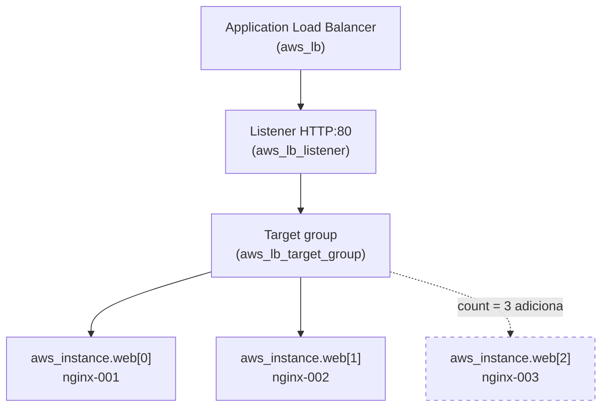

# 01.3 - Count: escalando a frota de servidores da Vortex

> **Quinta-feira, 11h. Mês 1 na Vortex Mobility.**
> O lançamento na nova cidade dobrou o tráfego no app da Vortex. Helena chega com a pressão da operação:
>
> > *— "Um servidor web não aguenta o pico do horário de almoço. Preciso de uma **frota** atrás de um load balancer, e preciso conseguir **escalar** rápido: de 2 para 5 servidores numa tarde de promoção, e de volta para 2 à noite. Não quero reescrever a infra cada vez — quero mudar **um número**."*
>
> Diego sorri: *— "É exatamente para isso que existe o `count`. Você descreve **um** servidor e diz quantos quer. O Terraform cuida do resto, inclusive de registrar no balanceador."*

Os comandos `bash` rodam **no terminal do Codespaces**. As verificações são feitas **no console da AWS** (painel EC2 / Load Balancer).

> [!WARNING]
> **Pré-requisitos obrigatórios antes de começar:**
>
> - [ ] [Lab 01.2 — Módulos](../02-Modules/README.md) concluído **por completo** — tanto o `vpc-call` (VPC + subnets) **quanto o `RT-call` (route tables com rota para o Internet Gateway)**. Sem as rotas, os servidores sobem mas ficam sem internet, não conseguem registrar no SSM e o provisionamento falha.
> - [ ] Credenciais AWS do Academy atualizadas no Codespaces
> - [ ] AWS CLI e `jq` disponíveis (o devcontainer já entrega; o passo 3 valida de novo)
> - [ ] Você consegue abrir o [painel EC2 → Load Balancers](https://us-east-1.console.aws.amazon.com/ec2/home?region=us-east-1#LoadBalancers:) e o [painel EC2 → Target Groups](https://us-east-1.console.aws.amazon.com/ec2/home?region=us-east-1#TargetGroups:) (é nos **Target Groups** que você vê as máquinas entrando e saindo)
>
> **Valide rapidamente que a rede do lab anterior existe e tem rota para a internet:**
>
> ```bash
> VPC_ID=$(aws ec2 describe-vpcs --filters "Name=tag:Name,Values=fiap-lab" --query "Vpcs[0].VpcId" --output text)
> echo "VPC: $VPC_ID"
> aws ec2 describe-route-tables --filters "Name=vpc-id,Values=$VPC_ID" \
>   --query "RouteTables[].Routes[?GatewayId!='local'].GatewayId" --output text
> ```
>
> Se a primeira linha imprimir um `vpc-...` **e** a segunda imprimir um `igw-...`, a rede está completa e você pode seguir. Se a VPC vier vazia, suba o `vpc-call`; se a VPC existir mas não houver `igw-...`, falta rodar o `RT-call` — volte ao [Lab 01.2](../02-Modules/README.md).
>
> **O que você vai fazer:** subir uma frota de 2 servidores web atrás de um Application Load Balancer (ALB), escalar para 3, reduzir para 1, e destruir tudo (frota + rede). **Tempo estimado: ~30 min.**

## Principais pontos de aprendizagem

- usar `count` para criar N cópias de um recurso a partir de uma única definição
- distribuir as cópias entre subnets de AZs distintas com `element()` e `count.index`
- registrar cada cópia da frota em um Application Load Balancer via `aws_lb_target_group_attachment` (também com `count`)
- entender os papéis de **target group**, **listener** e **target group attachment** no ALB
- escalar para cima e para baixo mudando apenas o `count`

## O que você terá ao final

Uma frota de servidores web da Vortex atrás de um load balancer, que escala de 2 para N **mudando um número** — exatamente o controle de capacidade que Helena pediu para os picos.

> [!TIP]
> Sempre que encontrar um bloco **💡 Clique para entender**, abra-o.

## Mapa do lab

| Parte | O que você faz | Passos | Tempo |
|-------|----------------|--------|-------|
| [Parte 1](#parte-1---subindo-a-frota-inicial) | Subindo a frota inicial (count = 2, provisionada via SSM) | [1](#passo-1) · [2](#passo-2) · [3](#passo-3) · [4](#passo-4) · [5](#passo-5) · [6](#passo-6) · [7](#passo-7) | ~15 min |
| [Parte 2](#parte-2---escalando-a-frota) | Escalando a frota (2 → 3 → 1) e destruindo | [8](#passo-8) · [9](#passo-9) · [10](#passo-10) · [11](#passo-11) · [12](#passo-12) · [13](#passo-13) | ~15 min |

> [!TIP]
> Se travou em algum passo, clique no número dele na coluna **Passos**.

## Por que essa abordagem existe

| Aspecto | Resposta curta |
|---------|----------------|
| **Problema de negócio** | A Vortex precisa variar a capacidade de servidores conforme o tráfego, rápido e sem retrabalho. |
| **Pergunta que responde bem** | "Quero N servidores idênticos atrás de um balanceador." |
| **Pergunta que responde mal** | "Quero servidores **diferentes entre si**" — aí `count` é fraco e `for_each` ou módulos servem melhor. |
| **Quando acontece na vida real** | Escalar web servers, workers de fila, réplicas de processamento batch. |

## Contexto

`count` é o jeito mais direto de criar várias cópias de um recurso. Você descreve a EC2 uma vez e diz `count = 2`; o Terraform cria `aws_instance.web[0]` e `aws_instance.web[1]`. O Application Load Balancer (`aws_lb`) não recebe as instâncias diretamente: cada EC2 é registrada num **target group** por um `aws_lb_target_group_attachment` — e como esse attachment também usa `count`, a frota inteira é registrada automaticamente. Para escalar, você muda o número e roda `apply` de novo — o Terraform calcula o delta (criar/destruir a diferença), inclusive os attachments correspondentes.



---

## Parte 1 - Subindo a frota inicial

### Resultado esperado desta parte

Dois servidores Nginx registrados no target group de um Application Load Balancer, acessíveis pelo DNS do balanceador. As duas máquinas são provisionadas **via AWS Systems Manager (SSM), em paralelo, sem chave SSH e sem porta 22**.

---

<a id="passo-1"></a>

**1.** Entre na pasta da demo:

```bash
cd /workspaces/FIAP-Platform-Engineering/01-Terraform/demos/03-Count
```

---

<a id="passo-2"></a>

**2.** Garanta as ferramentas do provisionamento. Cada EC2 da frota é provisionada via SSM, o que usa a **AWS CLI** e o **`jq`** na sua própria máquina (o Codespaces) para enviar o `script.sh`. O devcontainer já instala ambos, mas se você começou o lab por aqui (pulou os anteriores), este passo garante:

```bash
# jq e unzip (Ubuntu) — unzip e necessario para o instalador da AWS CLI
sudo apt-get update -y && sudo apt-get install -y jq unzip

# AWS CLI v2 (Ubuntu/x86_64) — instalador oficial da AWS
command -v aws >/dev/null || {
  curl -s "https://awscli.amazonaws.com/awscli-exe-linux-x86_64.zip" -o /tmp/awscliv2.zip
  unzip -q /tmp/awscliv2.zip -d /tmp
  sudo /tmp/aws/install --update
}

aws --version && jq --version
```

Se as duas últimas linhas imprimirem as versões, está pronto. O `script.sh` começa com `set -euo pipefail`, então qualquer falha no servidor propaga o erro e **aborta o `apply`** — mesma garantia de um provisioner SSH.

---

<a id="passo-3"></a>

**3.** Inicialize:

```bash
terraform init
```

---

<a id="passo-4"></a>

**4.** Aplique para criar a frota inicial. O Terraform cria as 2 EC2 e dispara o provisionamento das duas **em paralelo** via SSM; o log de cada máquina (a instalação do Nginx) aparece no próprio output do `apply`:

```bash
terraform apply -auto-approve
```

> [!TIP]
> Procure no output os blocos `----- log de <instance-id> -----` — um por máquina. É o `StandardOutputContent` que o SSM devolveu de cada servidor, auditável direto no `apply`. Se qualquer um falhar (`Status` diferente de `Success`), o `apply` é abortado.

<details>
<summary><b>💡 Clique para entender: o código real desta demo</b></summary>
<blockquote>

Esta demo usa um **Application Load Balancer (ALB)** — o load balancer moderno da AWS, recurso `aws_lb`. Diferente do Classic ELB (que recebia a lista de instâncias direto no atributo `instances`), o ALB separa as responsabilidades em três recursos: o **target group** agrupa os alvos e faz o health check, o **listener** recebe o tráfego HTTP:80 e o encaminha ao target group, e cada EC2 entra no target group por um **target group attachment**.

**`versions.tf`** declara os providers (`aws ~> 6.0` e `http ~> 3.0` — o `http` é usado pelo check block, mais abaixo).

**`variables.tf`** define a região e descobre a AMI dinamicamente (Amazon Linux 2023):

```hcl
data "aws_ami" "amazon_linux" {
  most_recent = true
  owners      = ["amazon"]
  filter {
    name   = "name"
    values = ["al2023-ami-2023.*-x86_64"]
  }
  filter {
    name   = "virtualization-type"
    values = ["hvm"]
  }
}
```

**`main.tf`** descobre a rede do Lab 01.2, filtra as subnets elegíveis, cria o ALB (com target group + listener) e a frota:

```hcl
# Descobre a VPC e as subnets publicas criadas no Lab 01.2 (por tag).
data "aws_vpc" "vpc" {
  tags = { Name = var.project }
}

data "aws_subnets" "all" {
  filter { name = "tag:Tier", values = ["Public"] }
  filter { name = "vpc-id",   values = [data.aws_vpc.vpc.id] }
}

data "aws_subnet" "public" {
  for_each = toset(data.aws_subnets.all.ids)
  id       = each.value
}

# Nem toda Availability Zone oferta todo tipo de instancia (ex.: us-east-1e nao
# tem t3.micro). Descobrimos as AZs que ofertam o tipo escolhido...
data "aws_ec2_instance_type_offerings" "supported" {
  filter {
    name   = "instance-type"
    values = [var.instance_type]
  }
  location_type = "availability-zone"
}

locals {
  # ...e ficamos com TODAS as subnets dessas AZs (o ALB exige >= 2 AZs), ordenadas
  # para um resultado deterministico (todo aluno obtem a mesma distribuicao).
  eligible_subnet_ids = sort([
    for s in data.aws_subnet.public : s.id
    if contains(toset(data.aws_ec2_instance_type_offerings.supported.locations), s.availability_zone)
  ])
}

# Application Load Balancer: opera na camada 7 (HTTP) e EXIGE subnets em >= 2 AZs,
# por isso entregamos a ele TODAS as subnets elegiveis, nao apenas uma.
resource "aws_lb" "web" {
  name               = "vortex-frota-alb"
  load_balancer_type = "application"
  subnets            = local.eligible_subnet_ids
  security_groups    = [aws_security_group.web.id]
}

# Target group: agrupa os alvos (as EC2) e define como verificar a saude deles.
resource "aws_lb_target_group" "web" {
  name     = "vortex-frota-tg"
  port     = 80
  protocol = "HTTP"
  vpc_id   = data.aws_vpc.vpc.id

  health_check {
    path                = "/"
    healthy_threshold   = 2
    unhealthy_threshold = 2
    timeout             = 3
    interval            = 6
  }
}

# Listener: recebe o trafego HTTP na porta 80 e encaminha ao target group.
resource "aws_lb_listener" "web" {
  load_balancer_arn = aws_lb.web.arn
  port              = 80
  protocol          = "HTTP"

  default_action {
    type             = "forward"
    target_group_arn = aws_lb_target_group.web.arn
  }
}

# A frota. count = 2 cria duas EC2 identicas; mudar esse numero escala a frota.
# As instancias sao distribuidas entre as subnets elegiveis com element(). Sem
# key_name e sem provisioner SSH: o acesso para provisionar e via SSM.
resource "aws_instance" "web" {
  count = 2

  instance_type          = var.instance_type
  ami                    = data.aws_ami.amazon_linux.id
  subnet_id              = element(local.eligible_subnet_ids, count.index)
  vpc_security_group_ids = [aws_security_group.web.id]
  iam_instance_profile   = "LabInstanceProfile"

  tags = {
    Name = format("nginx-%03d", count.index + 1)
  }
}

# Provisiona cada servidor da frota via SSM (sem SSH, sem chave). Como tambem usa
# count, ha um terraform_data por instancia: cada um envia o script.sh via
# 'aws ssm send-command', espera terminar e ABORTA o apply se o Status != Success.
# Por usarem count, os provisionamentos rodam em paralelo.
resource "terraform_data" "provisiona" {
  count = length(aws_instance.web)

  triggers_replace = {
    instance_id = aws_instance.web[count.index].id
    script_hash = filesha256("${path.module}/script.sh")
  }

  provisioner "local-exec" {
    interpreter = ["bash", "-c"]
    command     = <<-EOT
      # 1. espera a instancia ficar Online no SSM
      # 2. envia o script.sh via 'aws ssm send-command' (AWS-RunShellScript)
      # 3. aguarda terminar, imprime o log e faz exit 1 se Status != Success
    EOT
  }
}

# Target group attachment: registra CADA instancia da frota no target group.
# Como tambem usa count, a frota inteira entra no TG automaticamente.
resource "aws_lb_target_group_attachment" "web" {
  count            = length(aws_instance.web)
  target_group_arn = aws_lb_target_group.web.arn
  target_id        = aws_instance.web[count.index].id
  port             = 80
}
```

Pontos-chave:

- `count = 2` cria `aws_instance.web[0]` e `aws_instance.web[1]`
- o ALB não conhece as instâncias diretamente: o **target group attachment** (também com `count`) registra cada `aws_instance.web[count.index].id` no target group — mude o `count` e os attachments acompanham
- `element(local.eligible_subnet_ids, count.index)` distribui as instâncias entre as subnets elegíveis (AZs distintas), ao contrário de jogar todas numa única subnet
- `format("nginx-%03d", count.index + 1)` nomeia as máquinas `nginx-001`, `nginx-002`, ...
- **provisionamento via SSM:** cada EC2 carrega o instance profile `LabInstanceProfile` (que já traz a permissão SSM no Learner Lab), e o `terraform_data.provisiona` (também com `count`) usa a AWS CLI para `aws ssm send-command` o `script.sh` em cada máquina, mostra o log no `apply` e aborta se falhar. Por usarem `count`, os provisionamentos das máquinas rodam **em paralelo**. Sem chave SSH, sem porta 22
- filtramos as AZs que ofertam o `var.instance_type` (a `us-east-1e`, por exemplo, não tem `t3.micro`), evitando o erro `Unsupported instance type` — e como o ALB exige subnets em **≥ 2 AZs**, usamos **todas** as subnets elegíveis em vez de sortear uma

**`securitygroup.tf`** cria o SG `aws_security_group.web` (`vortex-frota-http`) liberando **apenas a porta 80** de entrada — não há mais regra de SSH (porta 22), porque o SSM fala de dentro da máquina para fora. **`script.sh`** começa com `set -euo pipefail` e instala o Nginx via `dnf` (Amazon Linux 2023). **`outputs.tf`** expõe o DNS do ALB (`alb_public`) e os endereços das instâncias. **`check.tf`** valida, pós-deploy, se o ALB já responde HTTP 200 (ver passo 5).

Documentação oficial: [aws_lb](https://registry.terraform.io/providers/hashicorp/aws/latest/docs/resources/lb) · [aws_lb_target_group](https://registry.terraform.io/providers/hashicorp/aws/latest/docs/resources/lb_target_group) · [count](https://developer.hashicorp.com/terraform/language/meta-arguments/count) · [aws ssm send-command](https://docs.aws.amazon.com/cli/latest/reference/ssm/send-command.html)

</blockquote>
</details>

---

<a id="passo-5"></a>

**5.** Aguarde alguns minutos para as máquinas ficarem prontas e o `apply` terminar. Abra o [painel EC2 → Target Groups](https://us-east-1.console.aws.amazon.com/ec2/home?region=us-east-1#TargetGroups:), **clique no target group `vortex-frota-tg`** e vá até a aba **Targets** (na parte de baixo da tela). É aqui — no target group, não no Load Balancer — que você acompanha as máquinas: você verá inicialmente as duas em estado **unhealthy** enquanto o ALB faz as verificações de integridade.

Logo ao final do `apply` o Terraform também roda um **check block** (arquivo `check.tf`) que tenta acessar `http://<dns-do-alb>/` e verificar se respondeu `200`. Como o ALB normalmente ainda está em *warm-up* nesse instante, é **esperado** ver um aviso como:

```text
Warning: Check block assertion known after apply
...
O ALB ainda nao respondeu 200 (pode estar em warm-up ou as instancias ainda registrando no target group). Rode 'terraform plan' de novo em ~1 min.
```

Isso é um **WARNING, não um erro** — não bloqueia nem desfaz o `apply`. Espere ~1 min (até os targets ficarem `healthy`) e rode `terraform plan` de novo: o aviso desaparece.

<details>
<summary><b>💡 Clique para entender: health checks do ALB e o check block</b></summary>
<blockquote>

Ao registrar uma instância no target group do ALB, ela não recebe tráfego imediatamente. O ALB faz **health checks** antes de considerá-la saudável:

- **Registro do alvo:** o target group reconhece a nova instância (via `aws_lb_target_group_attachment`) e a inclui no pool.
- **Health checks:** o ALB requisita `GET /` na porta 80 (no nosso `health_check`, `path = "/"`, `interval = 6s`, `healthy_threshold = 2`). Só após 2 respostas saudáveis seguidas a instância vira `healthy`.
- **Propagação:** o nome DNS do ALB leva alguns instantes para começar a encaminhar para o novo alvo.

Por isso é normal ver `unhealthy` logo após o `apply` — o Nginx ainda está subindo e o ALB ainda não validou a máquina.

Sobre o **check block** (`check.tf`, disponível no Terraform 1.5+): ele faz uma verificação de saúde **pós-deploy**, como último passo do `apply`. Diferente de um recurso, um `check` que falha gera um **aviso** (não um erro): sinaliza "subiu, mas ainda não está saudável" sem quebrar o fluxo. No comportamento real testado, o primeiro `apply` mostra o warning (`Error making request`); ~1 min depois, com os targets `healthy`, o `terraform plan` não mostra mais nenhum aviso.

Documentação oficial: [Health checks de target group](https://docs.aws.amazon.com/elasticloadbalancing/latest/application/target-group-health-checks.html) · [check blocks](https://developer.hashicorp.com/terraform/language/checks)

</blockquote>
</details>


---

<a id="passo-6"></a>

**6.** Na mesma tela ([Target Groups](https://us-east-1.console.aws.amazon.com/ec2/home?region=us-east-1#TargetGroups:) → `vortex-frota-tg` → aba **Targets**), atualize (botão de refresh) até que **todas** as máquinas apareçam como **healthy**.


---

<a id="passo-7"></a>

**7.** Copie o DNS do ALB (saída `alb_public` do Terraform no Codespaces) e cole no navegador para testar a stack.


### Checkpoint

Se chegou até aqui:

- duas instâncias `nginx-001` e `nginx-002` estão rodando
- ambas aparecem `healthy` no target group `vortex-frota-tg`
- o DNS do ALB serve a página do Nginx

---

## Parte 2 - Escalando a frota

### Resultado esperado desta parte

Você terá escalado a frota de 2 para 3 e de volta para 1 mudando apenas o `count`, observando o Terraform calcular o delta, e destruído tudo no final.

---

<a id="passo-8"></a>

**8.** Abra o `main.tf` e altere o `count` da `aws_instance.web` para `3`:

```bash
code main.tf
```

No bloco `resource "aws_instance" "web"`, troque `count = 2` por `count = 3`.


---

<a id="passo-9"></a>

**9.** Veja o plano: deve haver **3 a adicionar** — a nova máquina (`aws_instance.web[2]`), o seu provisionamento via SSM (`terraform_data.provisiona[2]`) e o seu target group attachment (`aws_lb_target_group_attachment.web[2]`), que a registra no ALB:

```bash
terraform plan
```


---

<a id="passo-10"></a>

**10.** Aplique a mudança. Só a nova máquina (`web[2]`) é provisionada via SSM — as duas já existentes não mudam:

```bash
terraform apply -auto-approve
```


Abra o [painel EC2 → Target Groups](https://us-east-1.console.aws.amazon.com/ec2/home?region=us-east-1#TargetGroups:), clique em `vortex-frota-tg` → aba **Targets**: a terceira máquina apareceu na lista (primeiro `unhealthy`, depois `healthy`) — você está **vendo a frota crescer ao vivo**.


---

<a id="passo-11"></a>

**11.** Volte ao `main.tf` e reduza o `count` para `1`:

```bash
code main.tf
```


---

<a id="passo-12"></a>

**12.** Aplique de novo. Desta vez serão **2 destruições** de máquina, mais os 2 provisionamentos (`terraform_data.provisiona[1]` e `[2]`) e os 2 target group attachments correspondentes (sobra apenas `aws_instance.web[0]`, seu provisionamento e seu attachment):

```bash
terraform apply -auto-approve
```


No [painel EC2 → Target Groups](https://us-east-1.console.aws.amazon.com/ec2/home?region=us-east-1#TargetGroups:) (`vortex-frota-tg` → aba **Targets**), as duas máquinas removidas saem da lista (passando por `draining`) e resta **uma única** — você está **vendo a frota encolher ao vivo**.


---

<a id="passo-13"></a>

**13.** Destrua **apenas a frota** deste lab (as EC2 + ALB). Estamos na pasta `03-Count`:

```bash
terraform destroy -auto-approve
```

> [!IMPORTANT]
> **Não destrua a rede (VPC e route tables).** A VPC `fiap-lab` (criada no Lab 01.2) é a fundação compartilhada de todo o curso — é usada pelos labs **01.4 (State)**, **01.5 (Workspaces)** e também pelo **Trabalho Final**. Ela **permanece de pé** o tempo todo: VPC, subnets e route tables são **gratuitas**, então não há custo em mantê-la. O que custa (e você destrói ao fim de cada lab) são as EC2 e o ALB.

<details>
<summary><b>⚠ Se der erro: <code>DependencyViolation</code> (ao destruir algo preso na VPC)</b></summary>
<blockquote>

Como **aqui você destrói só a frota** (a VPC permanece de pé), este erro não deve ocorrer neste passo. Ele aparece quando se tenta destruir uma VPC com algum recurso ainda preso nela — não é o caso deste lab, em que a rede é mantida de propósito.

</blockquote>
</details>

### Checkpoint

Se chegou até aqui:

- você escalou a frota 2 → 3 → 1 só mudando o `count`
- destruiu **a frota** (EC2 + ALB), confirmando que nada da frota ficou cobrando
- **manteve a rede de pé** (VPC + route tables) para os próximos labs

---

## Conclusão

Você escalou uma frota inteira mudando um único número. O `count` transforma capacidade em parâmetro, e o ALB acompanha automaticamente — porque o target group attachment também é regido pelo `count`. Esse é o controle elástico que toda operação web precisa.

**Mensagem para Helena:** a frota da Vortex agora é elástica. Pico de almoço? `count = 6`. Madrugada? `count = 2`. Um número, um `apply`, e o load balancer se ajusta sozinho. O próximo problema é mais sutil: à medida que o time cresce, **onde fica o estado** dessa infra para todos trabalharem sem se atropelar?

## Próximo passo

Abra o próximo lab: **[Lab 01.4 — State remoto](../04-State/README.md)**.

Lá vamos mover o estado do Terraform para um bucket S3 compartilhado, para que o time inteiro da Vortex colabore na mesma infraestrutura sem corromper o estado.

> [!CAUTION]
> **Custo:** este lab roda até 3 EC2 `t3.micro` (~$0,01/h cada) + 1 Application Load Balancer (~$0,0225/h + LCU; para a escala do lab, mesma ordem de grandeza). Confirme no painel EC2 que **nenhuma** instância ficou `running` e que o load balancer `vortex-frota-alb` sumiu após o passo 13. A **VPC continua de pé** de propósito (sem custo — VPC, subnets e route tables são gratuitas) e é mantida assim por **todo o curso**: os módulos 02 (Ansible), 03 (CI/CD) e o Trabalho Final também a usam. Nenhum lab a destrói. Esquecer uma EC2/ALB ligados por um dia consome alguns dólares do orçamento do Learner Lab — mas a rede em si não pesa.

---

### Exercício

Para fixar, faça o exercício prático: **[Exercício — Count com SQS](../../exercicios/count/README.md)**.

---

<details>
<summary><b>💡 Glossário rápido — termos que aparecem neste lab</b></summary>
<blockquote>

| Termo | O que é |
|-------|---------|
| **`count`** | Meta-argumento que cria N cópias indexadas de um recurso (`.web[0]`, `.web[1]`...). |
| **`count.index`** | Índice (0, 1, 2...) da cópia atual, usado para diferenciar nomes/tags e distribuir subnets. |
| **`element(lista, i)`** | Função que pega o item `i` de uma lista de forma circular; aqui espalha as EC2 entre as subnets elegíveis. |
| **Application Load Balancer (`aws_lb`)** | Balanceador de carga moderno da AWS, camada 7 (HTTP). Exige subnets em ≥ 2 AZs. |
| **Target group (`aws_lb_target_group`)** | Agrupa os alvos (EC2) do ALB e define o health check que decide quem está saudável. |
| **Listener (`aws_lb_listener`)** | Recebe o tráfego (HTTP:80) no ALB e o encaminha para o target group. |
| **Target group attachment (`aws_lb_target_group_attachment`)** | Registra uma EC2 no target group; com `count`, registra a frota inteira. |
| **Health check** | Verificação periódica (`GET /`) que o ALB faz para decidir se um alvo recebe tráfego. |
| **healthy / unhealthy** | Estados de um alvo no target group do ALB (aprovado / reprovado no health check). |
| **check block (`check.tf`)** | Verificação pós-deploy (Terraform 1.5+); falha gera **aviso**, não erro, sem desfazer o `apply`. |
| **SSM (Systems Manager)** | Serviço da AWS que executa o `script.sh` em cada EC2 sem SSH/porta 22; aqui provisiona a frota inteira via `terraform_data` + `count`. |
| **Instance profile (`LabInstanceProfile`)** | Perfil IAM anexado a cada EC2 que concede a ela permissão de SSM no Learner Lab. |

</blockquote>
</details>

<details>
<summary><b>💡 Como pedir ajuda se travou</b></summary>
<blockquote>

Antes de pedir ajuda, colete estas 4 informações:

1. **Em que passo você está** (ex.: "passo 9, escalei para 3")
2. **Mensagem de erro literal** (texto do terminal)
3. **Saída de** `terraform output` e do filtro de VPC do checklist de pré-requisitos
4. **O que você já tentou**

Canais (em ordem de prioridade):

- **Issues do repositório**: [github.com/vamperst/FIAP-Platform-Engineering/issues](https://github.com/vamperst/FIAP-Platform-Engineering/issues)
- **E-mail do professor**: `Rafael@rfbarbosa.com`
- **Antes de tudo**: se o `apply` falhar reclamando que não acha a VPC ou subnets, a rede do Lab 01.2 não está de pé. Rode o filtro de VPC do checklist; se vier vazio, volte ao Lab 01.2.

</blockquote>
</details>
