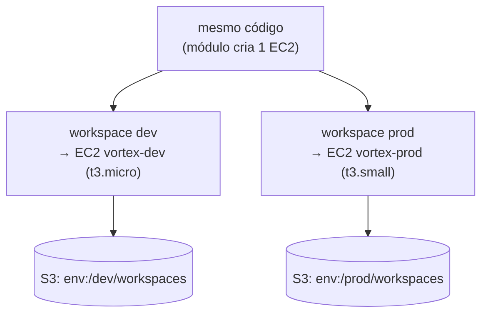

# 01.5 - Workspaces: isolando dev e prod da Vortex

> **Segunda-feira da semana seguinte, 10h. Fim do Mês 1 na Vortex Mobility.**
> Com o estado já no S3, falta o último pilar. Helena fecha o ciclo:
>
> > *— "Hoje a gente testa mudança de infra direto em produção, porque só temos um ambiente. Já derrubamos o app testando uma rede nova. Quero um **dev** e um **prod** separados, com o **mesmo código** — e o dev pode ser uma máquina menor e mais barata. Não quero manter duas cópias que vão divergir."*
>
> Diego arremata: *— "Workspaces. Mesmo código, estados separados por ambiente. Você troca de `dev` para `prod` com um comando, o Terraform sabe que são duas infras distintas — e o tamanho do servidor varia conforme o ambiente."*

Os comandos `bash` rodam **no terminal do Codespaces**. A verificação é feita **no console da AWS** (EC2 e S3) e no terminal.

> [!WARNING]
> **Pré-requisitos obrigatórios antes de começar:**
>
> - [ ] [Lab 01.2 — Módulos](../02-Modules/README.md) concluído — a VPC `fiap-lab` com subnets públicas precisa existir, porque a EC2 deste lab nasce nela
> - [ ] [Lab 01.4 — State remoto](../04-State/README.md) concluído (você configurou um backend S3)
> - [ ] Credenciais AWS do Academy atualizadas no Codespaces
> - [ ] O nome do seu bucket S3 (`aws s3 ls`)
>
> **Valide a VPC do Lab 01.2 (a EC2 deste lab depende dela):**
>
> ```bash
> aws ec2 describe-vpcs --filters "Name=tag:Name,Values=fiap-lab" \
>   --query "Vpcs[0].VpcId" --output text
> ```
>
> Se imprimir um `vpc-...`, a rede existe e você pode seguir. Se vier `None`, suba a VPC voltando ao [Lab 01.2](../02-Modules/README.md).
>
> **Descubra o nome do bucket S3:**
>
> ```bash
> aws s3 ls
> ```
>
> **O que você vai fazer:** configurar o backend, criar workspaces `dev` e `prod`, aplicar em cada um e ver que **cada ambiente cria sua própria EC2 com tamanho diferente** (dev menor/barato, prod maior) e seu próprio estado no S3 — depois validar tudo com `terraform test`. **Tempo estimado: ~30 min.**

> [!NOTE]
> Esta demo cria um **recurso AWS real**: uma instância EC2 por workspace. O ambiente atual (`dev`/`prod`) define o **tamanho** da instância — `dev` sobe uma `t3.micro` (pequena e barata), `prod` sobe uma `t3.small` (maior). Mesmo código, ambientes isolados e dimensionados diferente. O estado de cada workspace vai para o S3.

## Principais pontos de aprendizagem

- o que são workspaces e quando usá-los (e quando **não** usá-los)
- criar, listar, selecionar e deletar workspaces
- interpolar `terraform.workspace` na configuração para variar o **dimensionamento** por ambiente
- entender que cada workspace tem seu próprio estado no backend
- validar a configuração de forma automatizada com `terraform test`

## O que você terá ao final

Os ambientes `dev` e `prod` da Vortex isolados sobre o **mesmo código**, cada um com uma EC2 dimensionada para o seu propósito (`dev` → `t3.micro`, `prod` → `t3.small`) e estado separado no S3 — exatamente a separação que Helena pediu para parar de testar em produção.

> [!TIP]
> Sempre que encontrar um bloco **💡 Clique para entender**, abra-o.

## Mapa do lab

| Parte | O que você faz | Passos | Tempo |
|-------|----------------|--------|-------|
| [Parte 1](#parte-1---criando-os-workspaces) | Criando os workspaces | [1](#passo-1) · [2](#passo-2) · [3](#passo-3) · [4](#passo-4) · [5](#passo-5) · [6](#passo-6) · [7](#passo-7) | ~10 min |
| [Parte 2](#parte-2---aplicando-por-ambiente) | Aplicando por ambiente e observando o dimensionamento | [8](#passo-8) · [9](#passo-9) · [10](#passo-10) · [11](#passo-11) · [12](#passo-12) · [13](#passo-13) | ~12 min |
| [Parte 3](#parte-3---validando-com-terraform-test) | Validando com `terraform test` e encerrando o módulo | [14](#passo-14) · [15](#passo-15) · [16](#passo-16) | ~8 min |

> [!TIP]
> Se travou em algum passo, clique no número dele na coluna **Passos**.

## Por que essa abordagem existe

| Aspecto | Resposta curta |
|---------|----------------|
| **Problema de negócio** | A Vortex precisa de dev e prod separados, com o mesmo código, mas com tamanhos de máquina diferentes (dev barato, prod robusto). |
| **Pergunta que responde bem** | "Mesma infra, ambientes isolados, troca rápida entre eles, variando só parâmetros como tamanho." |
| **Pergunta que responde mal** | "Ambientes com **configurações radicalmente diferentes** ou prod crítico isolado de verdade" — aí pasta/repositório por ambiente serve melhor (ver o trade-off abaixo). |
| **Quando acontece na vida real** | Pipelines de CI/CD que promovem a mesma stack de dev → homol → prod, ajustando dimensionamento. |

## Contexto

Todo projeto Terraform começa no workspace `default`. Ao criar workspaces adicionais (`dev`, `prod`), você passa a ter **um estado por workspace**, todos sobre o mesmo código. A expressão `terraform.workspace` devolve o nome do ambiente atual, e você a usa para variar valores — neste lab, o **tipo da instância EC2**. No backend S3, cada workspace ganha seu próprio caminho de estado (`env:/<workspace>/<key>`).



---

## Parte 1 - Criando os workspaces

### Resultado esperado desta parte

Os workspaces `dev` e `prod` criados, com o backend S3 inicializado.

---

<a id="passo-1"></a>

**1.** Entre na pasta da demo:

```bash
cd /workspaces/FIAP-Platform-Engineering/01-Terraform/demos/05-Workspaces
```

---

<a id="passo-2"></a>

**2.** Abra o `state.tf` e troque o `bucket` pelo nome do seu bucket S3 (descubra com `aws s3 ls` se não lembrar):

```bash
code state.tf
```

---

<a id="passo-3"></a>

**3.** Inicialize o Terraform:

```bash
terraform init
```

<details>
<summary><b>⚠ Se der erro: o nome do bucket está incorreto</b></summary>
<blockquote>

Se o `init` falhar reclamando do bucket, corrija o nome no `state.tf` e reconfigure o backend:

```bash
terraform init -reconfigure
```

</blockquote>
</details>

<details>
<summary><b>💡 Clique para entender: o módulo que dimensiona a EC2 por workspace</b></summary>
<blockquote>

O módulo em `modules/file/` cria **uma instância EC2** cujo **tipo** depende do workspace atual. A raiz (`main.tf`) só invoca o módulo passando `project = "vortex"`.

**`modules/file/main.tf`** (trecho essencial):

```hcl
locals {
  env = terraform.workspace

  // Mapa de "tamanho" do servidor por workspace
  context = {
    default = { instance_type = "t3.micro" }
    dev     = { instance_type = "t3.micro" }
    homol   = { instance_type = "t3.small" }
    prod    = { instance_type = "t3.small" }
  }

  // lookup com fallback para 'default' se o workspace nao estiver no mapa
  context_variables = lookup(local.context, local.env, local.context["default"])
}

// Descobre a VPC fiap-lab e uma subnet publica em AZ que oferta o tipo
data "aws_vpc" "vpc" { tags = { Name = "fiap-lab" } }

resource "aws_instance" "server" {
  ami           = data.aws_ami.amazon_linux.id
  instance_type = local.context_variables.instance_type
  subnet_id     = local.eligible_subnet_ids[0]

  tags = {
    Name = "${var.project}-${local.env}"   // ex: vortex-dev, vortex-prod
    Env  = local.env
  }
}
```

- `terraform.workspace` devolve o nome do ambiente atual (`dev`, `prod`...).
- O mapa `context` traduz o workspace num `instance_type` — pequeno em dev, maior em prod.
- O mesmo padrão das demos 01.3/01.4 descobre a VPC `fiap-lab` por tag e escolhe uma subnet pública em uma AZ que oferta aquele tipo de instância.
- A tag `Name` carrega o ambiente (`vortex-dev`, `vortex-prod`), então todo recurso fica rastreável por workspace no console.

Cada workspace, ao rodar `apply`, cria uma EC2 de **tamanho diferente** — esse é o uso real de workspace: mesmo código, ambientes dimensionados conforme a necessidade.

Documentação oficial: [Workspaces](https://developer.hashicorp.com/terraform/language/state/workspaces) · [aws_instance](https://registry.terraform.io/providers/hashicorp/aws/latest/docs/resources/instance)

</blockquote>
</details>

---

<a id="passo-4"></a>

**4.** Crie o workspace `dev`:

```bash
terraform workspace new dev
```

---

<a id="passo-5"></a>

**5.** Crie o workspace `prod`:

```bash
terraform workspace new prod
```

---

<a id="passo-6"></a>

**6.** Volte para o ambiente `dev`:

```bash
terraform workspace select dev
```

<details>
<summary><b>💡 Clique para entender: comandos de workspace</b></summary>
<blockquote>

Os principais comandos:

```bash
terraform workspace new <nome>      # cria e já entra no novo workspace
terraform workspace list            # lista todos (o * marca o atual)
terraform workspace select <nome>   # troca para outro workspace
terraform workspace delete <nome>   # remove (não pode ser o atual)
```

Cada workspace mantém um estado separado no backend. No S3, o Terraform cria o caminho `env:/<workspace>/<key>` para cada um — por isso `dev` e `prod` não se misturam.

</blockquote>
</details>

---

<a id="passo-7"></a>

**7.** Liste os workspaces. Note o `default` (criado automaticamente pelo Terraform) além de `dev` e `prod`:

```bash
terraform workspace list
```

<!-- PRINT SUGERIDO: images/workspacescommands.png
     Capturar o terminal mostrando a saída de `terraform workspace list`,
     com o `*` marcando o workspace `dev` como atual. -->


### Checkpoint

Se chegou até aqui:

- o backend S3 está inicializado
- os workspaces `dev` e `prod` existem
- você está posicionado no workspace `dev`

---

## Parte 2 - Aplicando por ambiente

### Resultado esperado desta parte

Cada workspace cria sua própria EC2 com tamanho diferente (`dev` → `t3.micro`, `prod` → `t3.small`) e seu próprio estado no S3, provando o isolamento e o dimensionamento por ambiente.

---

<a id="passo-8"></a>

**8.** Com o workspace `dev` selecionado, aplique:

```bash
terraform apply -auto-approve
```

Ao final, confira o tipo da instância criada para o `dev`:

```bash
terraform output instance_type
```

Resultado esperado:

```
"t3.micro"
```

---

<a id="passo-9"></a>

**9.** Troque para `prod` e aplique também:

```bash
terraform workspace select prod && terraform apply -auto-approve
```

Confira o tipo da instância criada para o `prod`:

```bash
terraform output instance_type
```

Resultado esperado:

```
"t3.small"
```

> [!NOTE]
> Mesmo código, mesmo `terraform output instance_type` — números diferentes (`t3.micro` em dev, `t3.small` em prod). É o workspace quem decide. Compare com um colega: se o tipo divergir do esperado, alguém aplicou no workspace errado.

---

<a id="passo-10"></a>

**10.** No [console do EC2](https://console.aws.amazon.com/ec2/home?region=us-east-1#Instances:), veja **duas** instâncias rodando: `vortex-dev` (`t3.micro`) e `vortex-prod` (`t3.small`). Pelo terminal, você consegue o mesmo:

```bash
aws ec2 describe-instances \
  --filters "Name=tag:Name,Values=vortex-dev,vortex-prod" "Name=instance-state-name,Values=running" \
  --query "Reservations[].Instances[].{Name:Tags[?Key=='Name']|[0].Value,Type:InstanceType}" \
  --output table
```

Resultado esperado (uma linha por ambiente):

```
-------------------------------
|      DescribeInstances      |
+--------------+--------------+
|     Name     |     Type     |
+--------------+--------------+
|  vortex-dev  |  t3.micro    |
|  vortex-prod |  t3.small    |
+--------------+--------------+
```

<!-- PRINT SUGERIDO: images/ec2-por-workspace.png
     Capturar o painel EC2 > Instances mostrando as duas instâncias
     vortex-dev (t3.micro) e vortex-prod (t3.small) lado a lado. -->

---

<a id="passo-11"></a>

**11.** No [console do S3](https://s3.console.aws.amazon.com/s3/buckets?region=us-east-1), abra seu bucket. Verá uma estrutura de pastas `env:/dev/` e `env:/prod/`, cada uma com um objeto `workspaces` — o estado isolado de cada ambiente.

---

<a id="passo-12"></a>

**12.** Ainda no workspace `prod`, destrua os recursos deste ambiente:

```bash
terraform destroy -auto-approve
```

A EC2 `vortex-prod` é encerrada; a `vortex-dev` continua de pé — os ambientes são independentes.

---

<a id="passo-13"></a>

**13.** No console do EC2, confirme que `vortex-prod` foi terminada (`terminated`/`shutting-down`) e que `vortex-dev` continua `running`. No console do S3, o objeto de estado do `prod` (em `env:/prod/`) continua existindo, mas praticamente vazio — o `destroy` limpou os recursos, não o objeto de estado.

### Checkpoint

Se chegou até aqui:

- aplicou em `dev` e `prod`, cada um criando uma EC2 com tamanho diferente
- confirmou os tipos com `terraform output instance_type` (`t3.micro` / `t3.small`)
- viu os estados separados no S3 (`env:/dev/`, `env:/prod/`)
- destruiu só o `prod` e confirmou que o `dev` ficou intacto

---

## Parte 3 - Validando com terraform test

### Resultado esperado desta parte

O `terraform test` roda e confirma, **sem criar infra**, que o workspace `default` produz uma `t3.micro` — a base para testar IaC dentro de um pipeline.

---

<a id="passo-14"></a>

**14.** Volte para o workspace `dev` (vamos deixar o `prod` destruído e o `dev` de pé) e dê uma olhada no arquivo de teste:

```bash
terraform workspace select dev
code tests/workspace.tftest.hcl
```

O conteúdo essencial:

```hcl
run "default_usa_t3_micro" {
  command = plan

  assert {
    condition     = output.instance_type == "t3.micro"
    error_message = "No workspace default, o instance_type deveria ser t3.micro."
  }
}
```

---

<a id="passo-15"></a>

**15.** Rode os testes:

```bash
terraform test
```

Resultado esperado:

```
tests/workspace.tftest.hcl... in progress
  run "default_usa_t3_micro"... pass
tests/workspace.tftest.hcl... tearing down
tests/workspace.tftest.hcl... pass

Success! 1 passed, 0 failed.
```

<details>
<summary><b>💡 Clique para entender: o que é <code>terraform test</code></b></summary>
<blockquote>

`terraform test` é o framework de testes nativo do Terraform (estável desde a **versão 1.6**). Você escreve arquivos `*.tftest.hcl` com um ou mais blocos `run`, cada um com asserções (`assert`) sobre outputs, valores de recursos ou variáveis.

- `command = plan` valida a configuração **sem criar infraestrutura** — ele só executa o plano e checa as asserções. (`command = apply`, o padrão, criaria os recursos de verdade e depois faria o teardown.)
- O `terraform test` executa no workspace `default`, cujo mapa de contexto define `t3.micro` — por isso a asserção `output.instance_type == "t3.micro"` passa.
- O teste falha se alguém quebrar o mapa de contexto (ex.: trocar por um tipo inválido no Learner Lab, ou remover a entrada `default`).

**Por que isso importa:** essa é a ponte para o módulo **03-CICD**. Num pipeline, antes de aplicar a infra, você roda `terraform test` para barrar mudanças que quebram a configuração — exatamente como um teste unitário barra código quebrado antes do merge.

Documentação oficial: [Tests](https://developer.hashicorp.com/terraform/language/tests)

</blockquote>
</details>

---

<a id="passo-16"></a>

**16.** Destrua a EC2 do `dev` para encerrar o lab sem deixar custo:

```bash
terraform destroy -auto-approve
```

> [!CAUTION]
> Não esqueça nenhum workspace de pé. Se ainda houver alguma EC2 `vortex-*` no console, selecione aquele workspace (`terraform workspace select <nome>`) e rode `terraform destroy -auto-approve`.

> [!IMPORTANT]
> **Não destrua a rede (VPC e route tables).** A VPC `fiap-lab` (criada no Lab 01.2 e mantida de pé desde então) é a **fundação compartilhada de todo o curso**: ainda é usada pelos módulos **02 (Ansible)** e **03 (CI/CD)** e pelo **Trabalho Final**, todos descobrindo essa rede por tag. As EC2 dos workspaces que você acabou de destruir é que custavam por hora — a VPC, subnets e route tables são **gratuitas** e ficam de pé sem agredir o orçamento da conta. **Nenhum lab do curso destrói essa rede.**

### Checkpoint

Se chegou até aqui:

- entendeu o arquivo `tests/workspace.tftest.hcl`
- rodou `terraform test` e viu `Success! 1 passed, 0 failed.`
- destruiu as EC2 de `dev` e `prod` — nenhuma instância `vortex-*` ficou rodando
- **manteve a rede de pé** (VPC + route tables) para os módulos 02, 03 e o Trabalho Final — sem custo, pois esses recursos são gratuitos

---

<details>
<summary><b>💡 Clique para entender: workspaces <i>vs.</i> pasta-por-ambiente (o trade-off honesto)</b></summary>
<blockquote>

Workspaces são convenientes, mas **não** são a melhor ferramenta para todo caso. No livro *Terraform: Up & Running*, Yevgeniy Brikman considera workspaces um **anti-padrão** para isolar ambientes sérios, por três motivos:

1. **Mesmo backend e mesmas credenciais.** Todos os workspaces compartilham o bucket S3 e as credenciais AWS. Não há isolamento de blast radius: um erro de permissão ou um bug que apaga o bucket afeta dev **e** prod.
2. **O ambiente fica invisível no código.** Em qual ambiente você está não está escrito em lugar nenhum do `.tf` — é **estado do CLI** (`terraform.workspace`). Quem lê o repositório não vê "isto é prod"; descobre só rodando `terraform workspace list`.
3. **É fácil rodar `destroy` no workspace errado.** Como a troca é um comando silencioso, dá para achar que está em `dev` e destruir `prod`. (Por isso o passo 13 deste lab insiste em conferir no console.)

A alternativa para ambientes sérios é **uma pasta por ambiente** (`dev/`, `prod/`), cada uma com seu próprio backend (bucket/conta separados) e variáveis. O ambiente fica explícito na estrutura de diretórios e o isolamento é real.

**Quando workspaces brilham:** variações efêmeras ou idênticas — um ambiente de teste descartável por feature branch, ambientes de CI temporários, ou casos como este lab onde a única diferença é um parâmetro (o tamanho da instância). **Quando preferir pasta-por-ambiente:** prod crítico que exige isolamento de conta, credenciais e blast radius.

A lição: aprenda a ferramenta **e** saiba quando não usá-la.

</blockquote>
</details>

---

## Conclusão

Você isolou `dev` e `prod` sobre o mesmo código, cada um com uma EC2 dimensionada para o seu propósito e estados separados no S3. Trocar de ambiente é um `terraform workspace select`, e o que você faz num não afeta o outro. Por cima, validou a configuração com `terraform test` sem precisar criar infra.

**Mensagem para Helena:** dev e prod da Vortex agora são ambientes isolados, com o mesmo código, máquinas dimensionadas (dev `t3.micro`, prod `t3.small`) e estados separados. Dá para testar uma rede nova em `dev` sem nenhum risco para produção. **Com isso, fechamos o Mês 1**: a infraestrutura da Vortex é código versionado, escalável, com estado compartilhado e ambientes isolados.

> ⏱️ **Cronômetro de reprodutibilidade — fechamento do Mês 1.** A pergunta "quanto tempo para recriar qualquer ambiente da Vortex do zero?" deixou de ser "dias, na mão" e virou: **um `terraform apply` por workspace**. Selecione o ambiente, aplique, e a infra inteira sobe — com o dimensionamento certo para cada um.

## Próximo passo

Você concluiu o módulo de Terraform. Para fixar, faça os dois exercícios:

- **[Exercício — Count com SQS](../../exercicios/count/README.md)**
- **[Exercício — State e Workspace com EC2](../../exercicios/State-e-workspace/README.md)**

Depois, prossiga para o **[Módulo 02 — Ansible](../../../02-Ansible/README.md)**, onde no Mês 2 vamos automatizar a configuração de servidores (um GitLab Runner próprio) de forma idempotente.

> [!CAUTION]
> **Custo:** esta demo cria até **2 instâncias EC2** (dev `t3.micro` + prod `t3.small`). Elas custam por hora enquanto estiverem `running`. **Destrua AMBOS os workspaces ao final** — você já destruiu o `prod` no passo 12 e o `dev` no passo 16. Para conferir que nada ficou de pé, selecione cada workspace e rode o destroy:
>
> ```bash
> terraform workspace select prod && terraform destroy -auto-approve
> terraform workspace select dev  && terraform destroy -auto-approve
> ```
>
> A **VPC `fiap-lab` permanece de pé** (sem custo — rede é gratuita); ela é usada pelos módulos 02, 03 e pelo Trabalho Final. Nenhum lab a destrói.

---

<details>
<summary><b>💡 Glossário rápido — termos que aparecem neste lab</b></summary>
<blockquote>

| Termo | O que é |
|-------|---------|
| **Workspace** | Instância nomeada de estado dentro do mesmo código; permite múltiplos ambientes. |
| **`default`** | Workspace criado automaticamente pelo Terraform; existe sempre. É o workspace em que o `terraform test` roda. |
| **`terraform.workspace`** | Expressão que devolve o nome do workspace atual; aqui usada para escolher o `instance_type`. |
| **`env:/<ws>/<key>`** | Caminho que o backend S3 usa para isolar o estado de cada workspace. |
| **`terraform test` / `.tftest.hcl`** | Framework de teste nativo (TF 1.6+). Arquivos `*.tftest.hcl` com blocos `run` e asserções; `command = plan` valida sem criar infra. |
| **Workspaces vs. pasta-por-ambiente** | Trade-off: workspaces compartilham backend/credenciais e escondem o ambiente no estado do CLI; pasta-por-ambiente dá isolamento real para prod sério. |
| **`locals`** | Bloco que define valores computados reutilizáveis dentro de um módulo. |

</blockquote>
</details>

<details>
<summary><b>💡 Como pedir ajuda se travou</b></summary>
<blockquote>

Antes de pedir ajuda, colete estas 4 informações:

1. **Em que passo você está** (ex.: "passo 9, `apply` no prod")
2. **Mensagem de erro literal** (texto do terminal)
3. **Saída de** `terraform workspace list` e `aws s3 ls`
4. **O que você já tentou**

Canais (em ordem de prioridade):

- **Issues do repositório**: [github.com/vamperst/FIAP-Platform-Engineering/issues](https://github.com/vamperst/FIAP-Platform-Engineering/issues)
- **E-mail do professor**: `Rafael@rfbarbosa.com`
- **Antes de tudo**: confira em qual workspace você está com `terraform workspace list` (o `*` marca o atual). Muito "por que a instância não mudou de tamanho?" é só estar no workspace errado.

</blockquote>
</details>
