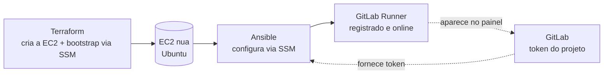

# 02.1 - Provisionando um GitLab Runner com Ansible

> **Segunda-feira, 10h.**
> Você é Platform Engineer na **Vortex Mobility**, a startup de micromobilidade que está escalando de 3 para 30 cidades. **Helena Marques**, Head de Engenharia de Plataforma, te chama:
>
> > *— "A gente vai automatizar os deploys da Vortex, mas o GitLab compartilhado não serve: precisamos de um runner **nosso**, que rode dentro da nossa conta AWS e tenha acesso às nossas credenciais. O problema é que configurar esse servidor na mão — instalar pacote, registrar o runner, ajustar o serviço — é um documento de 30 passos que ninguém lembra. Quero subir um runner novo rodando **um playbook**, não seguindo um wiki."*
>
> Você já sabe que o Terraform cria a máquina. Agora precisa **ver o Ansible configurar essa máquina** do zero até virar um runner registrado. **Diego**, o SRE sênior, passa na sua mesa: *— "Faz uma vez no braço pra entender cada peça. Depois é só rodar o playbook."*

Esse laboratório é o que vamos fazer juntos durante a aula: provisionar uma EC2 com Terraform, conectar essa máquina ao Ansible e rodar um playbook que a transforma num **GitLab Runner registrado** e dedicado a um projeto. No final, você terá feito tudo o que Helena precisava para parar de configurar servidor na mão.

> Os comandos deste lab rodam em **dois lugares**: o **terminal do Codespaces** (onde estão Terraform e Ansible) e o **console web do GitLab** (onde você cria o projeto e gera o token). Cada passo indica onde executar. A chave SSH que você vai gerar serve **só** para autenticar o `git push` no GitLab — o acesso à EC2 do runner é feito via AWS Systems Manager (SSM), sem chave e sem porta 22.
>
> O **token de registro do runner** (um segredo) **não** é colado dentro de nenhum arquivo do projeto: você o guarda uma vez no **AWS SSM Parameter Store** (como `SecureString`) e o Ansible o lê em tempo de execução. Assim nenhum segredo entra no Git.

> [!WARNING]
> **Pré-requisitos obrigatórios antes de começar:**
>
> - [ ] **Módulo 01 (Terraform) concluído** — você entende `init/plan/apply` e state remoto no S3
> - [ ] Bucket de state remoto existe no S3 (`base-config-<SEU-RM>`, criado no [setup inicial](../../00-create-codespaces/README.md)) — este mesmo bucket é reutilizado pelo Ansible-via-SSM para transferir arquivos
> - [ ] Credenciais AWS do Academy atualizadas no Codespaces (o acesso à EC2 é via SSM, então as credenciais AWS no ambiente são o que autentica a conexão)
> - [ ] Ferramentas do Ansible-via-SSM instaladas no Codespaces (`session-manager-plugin`, `boto3`, collections `community.aws` e `amazon.aws`) — você instala no **passo 3** mais abaixo
> - [ ] Conta no [GitLab](https://gitlab.com/) (gratuita)
>
> **Valide rapidamente:**
>
> ```bash
> aws sts get-caller-identity
> ```
>
> Se retornar o JSON com seu `Account` e `Arn`, você está pronto.

## O que você vai fazer

Tempo estimado: **60–90 min** (execução pura ~25 min — o `terraform apply` provisiona a EC2 e roda o bootstrap, e o `ansible-playbook` leva alguns minutos — mais o tempo para você ler, copiar comandos, observar resultados nos prints e entender cada peça).

Vamos separar com clareza **quem faz o quê**: o **Terraform** cria a EC2 e prepara o sistema operacional mínimo; o **Ansible** entra depois e configura essa EC2 de forma declarativa até ela virar um GitLab Runner registrado. Esse é o padrão clássico de IaC + config management que você vai usar pelo resto da carreira.

## Principais pontos de aprendizagem

- instalar e usar Ansible a partir de um ambiente isolado (virtualenv)
- preparar o Codespaces para conectar via SSM (`session-manager-plugin`, `boto3`, collection `community.aws`)
- gerar e registrar uma chave SSH para autenticar o `git push` no GitLab
- criar um projeto no GitLab e gerar um token de registro de runner
- guardar esse token como segredo no **AWS SSM Parameter Store** (`SecureString`) em vez de hardcode no código
- provisionar a EC2 do runner com Terraform usando state remoto no S3
- conectar o Ansible ao host criado via inventário (`hosts`), usando o connection plugin `community.aws.aws_ssm` (sem chave SSH, sem porta 22)
- rodar um playbook que instala, configura e **registra** o GitLab Runner — lendo o token direto do SSM
- deixar o runner de pé para o módulo 03 (a destruição da infra acontece ao final do Lab 03.2)

## O que você terá ao final

Ao final deste laboratório, você terá uma EC2 rodando como **GitLab Runner registrado** e visível no painel do seu projeto GitLab, configurada inteiramente por um playbook Ansible. **Helena vai querer ver o runner aparecendo "online" no painel de CI/CD do projeto** — esse é o entregável simbólico do lab.

> [!TIP]
> Sempre que encontrar um bloco com o título **💡 Clique para entender**, abra esse trecho. Ele traz a anatomia do comando, o contexto prático e links oficiais para aprofundamento.

## Mapa do lab

| Parte | O que você faz | Passos | Tempo |
|-------|----------------|--------|-------|
| [Parte 1](#parte-1---preparando-o-ambiente) | Atualizar o repositório e entrar na pasta | [1](#passo-1) · [2](#passo-2) | ~3 min |
| [Parte 2](#parte-2---instalando-ansible-python-e-virtualenv) | Instalar Python, Ansible, virtualenv e as ferramentas de SSM | [3](#passo-3) (3.1·3.2·3.3·3.4·3.5) | ~12 min |
| [Parte 3](#parte-3---configurando-o-acesso-ao-gitlab) | Conta GitLab e chave SSH | [4](#passo-4) · [5](#passo-5) (5.1–5.6) | ~10 min |
| [Parte 4](#parte-4---criando-o-primeiro-projeto-no-gitlab) | Criar o projeto e subir o código | [6](#passo-6) · [7](#passo-7) · [8](#passo-8) · [9](#passo-9) (9.1–9.6) | ~10 min |
| [Parte 5](#parte-5---gerando-o-token-do-runner-e-guardando-no-ssm) | Gerar o token e guardá-lo no SSM | [10](#passo-10) · [11](#passo-11) · [12](#passo-12) · [13](#passo-13) · [14](#passo-14) · [15](#passo-15) · [16](#passo-16) | ~10 min |
| [Parte 6](#parte-6---provisionando-a-ec2-do-runner-com-terraform) | Provisionar a EC2 com Terraform | [17](#passo-17) · [18](#passo-18) · [19](#passo-19) · [20](#passo-20) · [21](#passo-21) · [22](#passo-22) | ~15 min |
| [Parte 7](#parte-7---configurando-a-ec2-como-runner-com-ansible) | Rodar o playbook Ansible | [23](#passo-23) · [24](#passo-24) · [25](#passo-25) · [26](#passo-26) | ~10 min |

> [!TIP]
> Se travou em algum passo, você pode pular direto: clique no número do passo na coluna **Passos** acima.

<details>
<summary><b>💡 O que é um GitLab Runner (e por que Ansible) em 3 parágrafos</b></summary>
<blockquote>

Um **GitLab Runner** é o processo que efetivamente **executa** os jobs de um pipeline de CI/CD. Quando você dá um push e o pipeline roda `terraform plan`, é o runner que pega esse job, executa os comandos numa máquina e devolve o resultado para o GitLab. Você pode usar os runners compartilhados do GitLab, mas empresas que rodam infraestrutura preferem um runner **próprio**, dentro da própria conta de nuvem, com acesso às próprias credenciais — é o caso da Vortex.

O runner é só um programa, mas para funcionar ele precisa de um servidor configurado: o pacote `gitlab-runner` instalado, o Terraform disponível (porque os jobs vão rodar Terraform), um serviço `systemd` ativo e o runner **registrado** no projeto via um token. Fazer isso na mão é o "documento de 30 passos" que a Helena reclamou.

É aí que entra o **Ansible**: em vez de um humano seguir um wiki, descrevemos o estado desejado da máquina em arquivos YAML (os *playbooks* e *tasks*) e o Ansible aplica esse estado de forma **idempotente** — rodar de novo não duplica nada. Neste lab o Ansible não conecta por SSH: usa o connection plugin `community.aws.aws_ssm`, que fala com a EC2 através do AWS Systems Manager (sem chave, sem porta 22). O Terraform cria a máquina; o Ansible a configura. Essa separação "provisionar vs. configurar" é um dos padrões mais importantes de plataforma.

Documentação oficial:
- [GitLab Runner](https://docs.gitlab.com/runner/)
- [Ansible — Getting Started](https://docs.ansible.com/ansible/latest/getting_started/index.html)

</blockquote>
</details>

## Contexto

A Vortex está montando seu pipeline de entrega contínua. O passo de hoje é ter um runner **dedicado**, dentro da conta AWS da empresa, capaz de rodar Terraform com as credenciais certas. Em vez de configurar esse servidor manualmente toda vez que precisar de um runner novo, vamos codificar a configuração com Ansible — um playbook que qualquer pessoa do time roda e obtém exatamente o mesmo runner. Esse runner é a peça que o módulo 03 (CI/CD) vai usar para automatizar `plan`/`apply`.



---

## Parte 1 - Preparando o ambiente

### Resultado esperado desta parte

Ao final desta etapa, você estará com o repositório atualizado e dentro da pasta do laboratório, no terminal do Codespaces.

---

<a id="passo-1"></a>

**1.** No **terminal do Codespaces**, entre na pasta principal do repositório e garanta que está com a versão mais atualizada do exercício:

```bash
cd /workspaces/FIAP-Platform-Engineering/
git reset --hard && git pull origin master
```

> [!IMPORTANT]
> O `git reset --hard` descarta alterações locais não commitadas. Se você tiver trabalho em andamento que queira manter, faça commit antes.

---

<a id="passo-2"></a>

**2.** Entre na pasta do laboratório:

```bash
cd /workspaces/FIAP-Platform-Engineering/02-Ansible/01-provisionando-gitlab-runner/
```

### Checkpoint

- o repositório está atualizado
- você está dentro de `02-Ansible/01-provisionando-gitlab-runner/`

---

## Parte 2 - Instalando Ansible, Python e virtualenv

### Resultado esperado desta parte

Ao final desta etapa, você terá Python nativo confirmado, Ansible instalado, um virtualenv ativo e as ferramentas de conexão via SSM (`session-manager-plugin`, `boto3`, collections `community.aws` e `amazon.aws`) prontas no terminal do Codespaces.

Esta parte é um único bloco grande no roteiro antigo. Vamos quebrá-la em sub-passos, cada um com uma validação rápida, para que — se algo falhar — você saiba exatamente onde travou.

---

<a id="passo-3"></a>

**3.** Vamos instalar e preparar o ambiente do Ansible. Execute os sub-passos abaixo **na ordem**, no terminal do Codespaces.

**3.1.** Atualize o sistema, confirme o Python 3 nativo e instale o pacote de virtualenv:

```bash
sudo apt update -y
sudo apt install -y python3 python3-pip python3-venv jq
python3 --version
```

Deve imprimir `Python 3.10.x` ou mais recente. É esse Python nativo que vamos usar — não precisamos de PPA nem de versões antigas.

**3.2.** Crie um ambiente Python isolado (virtualenv) com o Python nativo:

```bash
python3 -m venv ~/venv
```

**3.3.** Ative o virtualenv:

```bash
source ~/venv/bin/activate
```

O prompt do terminal deve passar a exibir o prefixo `(venv)`. Esse prefixo confirma que o ambiente está ativo.

<details>
<summary><b>💡 Clique para entender: por que virtualenv (e por que instalar o Ansible dentro dele)</b></summary>
<blockquote>

Um **virtualenv** é um diretório isolado com sua própria cópia do Python e dos pacotes. Em vez de instalar dependências "globalmente" no sistema (onde elas podem conflitar com outras ferramentas), você as mantém presas a um ambiente que pode ser ativado e desativado.

O prefixo `(venv)` no prompt é o sinal de que tudo o que você instalar com `pip` daqui em diante fica dentro desse ambiente. Se você abrir um novo terminal, precisa rodar `source ~/venv/bin/activate` de novo — o ambiente não se ativa sozinho.

**Por que instalamos o Ansible aqui dentro (via `pip`) e não pelo `apt`?** Porque o connection plugin do SSM e o *lookup* que lê o token precisam do `boto3` **no mesmo Python que executa o Ansible**. Se o Ansible viesse do `apt` (Python do sistema) e o `boto3` fosse instalado no venv, eles ficariam em Pythons diferentes e o Ansible reclamaria `Failed to import boto3`. Mantendo Ansible **e** boto3 dentro do venv, tudo roda no mesmo interpretador.

Documentação oficial:
- [venv — Python](https://docs.python.org/3/library/venv.html)

</blockquote>
</details>

**3.4.** Com o `(venv)` ativo, instale o Ansible, o `boto3`/`botocore` e as collections — tudo no mesmo Python do venv:

```bash
pip install ansible boto3 botocore
ansible-galaxy collection install community.aws amazon.aws
```

Confirme a versão (o caminho deve apontar para dentro de `~/venv`):

```bash
ansible --version
```

**3.5.** Instale o `session-manager-plugin`, que o Ansible usa para abrir a sessão SSM com a EC2 (o AWS CLI e o `jq` já vêm do devcontainer):

```bash
command -v session-manager-plugin >/dev/null || {
  curl "https://s3.amazonaws.com/session-manager-downloads/plugin/latest/ubuntu_64bit/session-manager-plugin.deb" -o /tmp/smp.deb
  sudo dpkg -i /tmp/smp.deb
}
session-manager-plugin --version
```

Deve imprimir um número de versão.

<details>
<summary><b>💡 Clique para entender: por que estas ferramentas</b></summary>
<blockquote>

Neste lab o Ansible não acessa a EC2 por SSH — ele usa o connection plugin `community.aws.aws_ssm`, que conversa com a máquina através do **AWS Systems Manager**. Para isso funcionar, o Codespaces precisa destas peças:

- **`aws` CLI e `jq`** — o devcontainer já instala estas duas; o comando acima só garante que `jq` existe (é usado pelo bootstrap do Terraform também).
- **`session-manager-plugin`** — é o binário que o plugin `aws_ssm` chama por baixo para abrir a sessão SSM. Não vem no devcontainer; é específico deste lab.
- **`boto3` / `botocore`** — SDK Python da AWS que o plugin `aws_ssm` usa para falar com a API do SSM e com o bucket S3.
- **collection `community.aws`** — onde vive o próprio connection plugin `aws_ssm`. Sem ela, o `ansible_connection=community.aws.aws_ssm` do inventário não resolve.
- **collection `amazon.aws`** — traz o *lookup* `ssm_parameter`, que o playbook usa para ler o token do runner do Parameter Store na hora de registrar (Parte 7).

Tudo isso é redundante de propósito: se você pulou algum lab anterior, os comandos com `command -v ... ||` só instalam o que faltar.

Documentação oficial:
- [community.aws.aws_ssm connection plugin](https://docs.ansible.com/ansible/latest/collections/community/aws/aws_ssm_connection.html)
- [Install the Session Manager plugin](https://docs.aws.amazon.com/systems-manager/latest/userguide/session-manager-working-with-install-plugin.html)

</blockquote>
</details>

### Checkpoint

- `python3 --version` responde 3.10.x ou mais recente
- `ansible --version` responde sem erro
- o prompt mostra `(venv)`
- `session-manager-plugin --version` responde sem erro
- `ansible-galaxy collection list community.aws amazon.aws` lista as duas collections instaladas

---

## Parte 3 - Configurando o acesso ao GitLab

### Resultado esperado desta parte

Ao final desta etapa, você terá uma conta GitLab e uma chave SSH registrada e ativa na sessão, capaz de autenticar seus `git push`.

---

<a id="passo-4"></a>

**4.** Antes de criar o runner, você precisa de uma conta no GitLab. Acesse o [GitLab](https://gitlab.com/) e crie uma conta — ou, se já tiver, apenas faça login.

---

<a id="passo-5"></a>

**5.** Para fazer `git push` para o GitLab via SSH, você vai criar e registrar uma chave de conexão. Siga os sub-passos abaixo.

**5.1.** No **terminal do Codespaces**, crie a chave SSH:

```bash
ssh-keygen -t rsa -b 2048 -C "gitlab key" -f /home/vscode/.ssh/gitlab
```

**5.2.** Pressione **Enter duas vezes** para indicar que não quer senha para a chave.


**5.3.** Abra a parte **pública** da chave no editor do Codespaces e copie todo o conteúdo para a área de transferência do seu computador:

```bash
code /home/vscode/.ssh/gitlab.pub
```

**5.4.** Acesse a página de chaves SSH do seu GitLab: [Chaves SSH do GitLab](https://gitlab.com/-/user_settings/ssh_keys).

**5.5.** Cole o conteúdo copiado no campo destacado e clique em **Add New Key**.


**5.6.** De volta ao **terminal do Codespaces**, ative a chave na sessão atual do terminal:

```bash
eval $(ssh-agent -s)
ssh-add -k /home/vscode/.ssh/gitlab
```

<details>
<summary><b>⚠ Se der erro: <code>Could not open a connection to your authentication agent</code> no ssh-add</b></summary>
<blockquote>

O `ssh-agent` não está rodando na sessão atual. Rode o `eval` antes do `ssh-add`, na mesma linha de raciocínio:

```bash
eval $(ssh-agent -s)
ssh-add -k /home/vscode/.ssh/gitlab
```

Lembre que o agent vive **por sessão de terminal**: se você abrir um novo terminal, precisa rodar o `eval` + `ssh-add` de novo.

</blockquote>
</details>

### Checkpoint

- a chave `gitlab` existe em `/home/vscode/.ssh/`
- a chave pública foi adicionada ao seu GitLab
- `ssh-add` confirmou a identidade adicionada

---

## Parte 4 - Criando o primeiro projeto no GitLab

### Resultado esperado desta parte

Ao final desta etapa, você terá um projeto `primeiro-projeto` no GitLab com o código de exemplo já versionado.

---

<a id="passo-6"></a>

**6.** No **console web do GitLab**, crie um novo projeto. Acesse [Novo projeto](https://gitlab.com/projects/new) e clique em **Create blank project**.

---

<a id="passo-7"></a>

**7.** Dê o nome de `primeiro-projeto`, marque como **Public** e **desmarque** a opção de inicializar com README.


---

<a id="passo-8"></a>

**8.** Clique em **Create project**.

---

<a id="passo-9"></a>

**9.** De volta ao **terminal do Codespaces**, você vai subir o código de exemplo para esse projeto. Siga os sub-passos, cuidando dos pontos onde precisa colocar suas informações.

**9.1.** Configure seu nome e e-mail do GitLab no git:

```bash
git config --global user.name "SEU NOME"
git config --global user.email "SEU EMAIL DO GITLAB"
```

**9.2.** Copie o código do projeto para outra pasta, para poder inicializar um repositório git separado:

```bash
cp -frv /workspaces/FIAP-Platform-Engineering/02-Ansible/01-provisionando-gitlab-runner/primeiro-projeto/ ~/environment/
```

**9.3.** Entre na pasta copiada:

```bash
cd /home/vscode/environment/primeiro-projeto
```

**9.4.** Inicialize o repositório e aponte para o seu projeto no GitLab (troque `SEU-USUARIO`):

```bash
git init
git remote add origin git@gitlab.com:SEU-USUARIO/primeiro-projeto.git
```

**9.5.** Adicione e faça o commit inicial:

```bash
git add .
git commit -m "Initial commit"
git branch -M master
```

**9.6.** Faça o push para o GitLab:

```bash
git push -uf origin master
```


<details>
<summary><b>⚠ Se der erro: <code>Permission denied (publickey)</code> no git push</b></summary>
<blockquote>

A chave SSH não está ativa na sessão ou não foi adicionada ao GitLab. Verifique:

1. Você rodou o `eval $(ssh-agent -s)` e `ssh-add` do passo 5.6 **neste mesmo terminal**?
2. A chave pública foi colada no GitLab (passo 5.5)?

Teste a conexão:

```bash
ssh -T git@gitlab.com
```

Deve responder com uma saudação contendo seu usuário. Se não, repita os sub-passos 5.5 e 5.6.

</blockquote>
</details>

### Checkpoint

- o projeto `primeiro-projeto` no GitLab mostra os arquivos do código
- o `git push` terminou sem erro de autenticação

---

## Parte 5 - Gerando o token do runner e guardando no SSM

### Resultado esperado desta parte

Ao final desta etapa, você terá um token de registro de runner gerado no GitLab e guardado com segurança no **AWS SSM Parameter Store** — sem colar segredo em nenhum arquivo do projeto.

---

<a id="passo-10"></a>

**10.** No seu projeto do GitLab, clique em **Settings** na lateral esquerda e depois em **CI/CD**.


---

<a id="passo-11"></a>

**11.** Em **Runners**, clique para expandir.


---

<a id="passo-12"></a>

**12.** Na aba **Instance**, desabilite a opção **Turn on instance runners for this project** — assim, o runner que vamos criar será usado apenas por este projeto.


---

<a id="passo-13"></a>

**13.** Clique em **Assigned project runners** e em seguida em **Create project runner**, para gerar o token que registrará o runner.


---

<a id="passo-14"></a>

**14.** No campo de **Tags**, adicione o valor `shell, terraform` e clique em **Create runner**.


> [!IMPORTANT]
> As **tags** do runner (`shell`, `terraform`) são definidas **aqui, na interface do GitLab** — e é assim que elas continuam valendo no fluxo atual. Desde o GitLab 16 o runner é criado primeiro na UI (gerando um token que começa com `glrt-`) e a máquina só se **vincula** a ele depois; as tags, o nível de acesso e o "run untagged" pertencem ao runner criado na UI, não ao comando de registro. Por isso é importante preencher as tags corretamente neste passo.

---

<a id="passo-15"></a>

**15.** Copie o token gerado para a área de transferência do seu computador.


---

<a id="passo-16"></a>

**16.** De volta ao **Codespaces**, guarde o token no **AWS SSM Parameter Store** — não em um arquivo. Rode o comando abaixo trocando `glrt-COLE-SEU-TOKEN-AQUI` pelo token que você copiou (mantenha as aspas):

```bash
aws ssm put-parameter \
  --name "/fiap/gitlab-runner/token" \
  --type SecureString \
  --value "glrt-COLE-SEU-TOKEN-AQUI" \
  --region us-east-1 \
  --overwrite
```

Você deve ver uma resposta com `"Version": 1` (ou um número maior, se já tinha gravado antes). Confirme que o token ficou guardado:

```bash
aws ssm get-parameter --name "/fiap/gitlab-runner/token" --with-decryption \
  --region us-east-1 --query 'Parameter.Value' --output text
```

Deve imprimir o seu token `glrt-...`. É esse parâmetro que o playbook vai ler automaticamente na hora de registrar o runner.

<!-- PRINT SUGERIDO: img/ssm-parameter-token.png
     Console AWS > Systems Manager > Parameter Store, mostrando o parametro
     /fiap/gitlab-runner/token do tipo SecureString na lista. Enquadrar a coluna
     Name e a coluna Type (SecureString). NAO mostrar o valor decifrado. -->


<details>
<summary><b>💡 Clique para entender: por que guardar o token no SSM Parameter Store</b></summary>
<blockquote>

O token de registro é um **segredo**: quem o tiver pode registrar runners no seu projeto. Colá-lo dentro de um arquivo `.yml` é perigoso — ele acabaria no histórico do Git, visível para sempre.

O **SSM Parameter Store** é um cofre de parâmetros da AWS. Guardando o token como `SecureString`, ele fica **criptografado** e fora do código. Na hora de registrar o runner, o Ansible usa um *lookup* (`amazon.aws.ssm_parameter`) que lê o valor direto do Parameter Store — usando as suas credenciais AWS, as mesmas do resto do lab. Nenhum segredo entra no repositório.

Esse é o padrão que você usaria de verdade num time de plataforma: segredos vivem num cofre (Parameter Store, Secrets Manager, Vault), nunca no código. Aqui você pratica isso com a ferramenta nativa da AWS, sem custo no Learner Lab.

- `--type SecureString` — criptografa o valor em repouso.
- `--name "/fiap/gitlab-runner/token"` — o caminho onde o playbook procura o token (definido em `play.yaml`).
- `--overwrite` — permite regravar se você precisar gerar um token novo depois.

Documentação oficial:
- [aws ssm put-parameter](https://docs.aws.amazon.com/cli/latest/reference/ssm/put-parameter.html)
- [amazon.aws.ssm_parameter lookup](https://docs.ansible.com/ansible/latest/collections/amazon/aws/ssm_parameter_lookup.html)

</blockquote>
</details>

### Checkpoint

- o token foi gerado no GitLab (com as tags `shell`, `terraform` na UI)
- o token está guardado em `/fiap/gitlab-runner/token` no SSM Parameter Store (`get-parameter` imprime o seu `glrt-...`)
- **nenhum** arquivo do projeto contém o token

---

## Parte 6 - Provisionando a EC2 do runner com Terraform

### Resultado esperado desta parte

Ao final desta etapa, você terá uma EC2 provisionada (já com Python/pip/awscli instalados pelo bootstrap via SSM) e o **instance id** dela em mãos para o inventário do Ansible.

---

<a id="passo-17"></a>

**17.** O runner será uma EC2 provisionada com Terraform. Entre na pasta com o código:

```bash
cd /workspaces/FIAP-Platform-Engineering/02-Ansible/01-provisionando-gitlab-runner/terraform-gitlab-runner/
```

---

<a id="passo-18"></a>

**18.** O state remoto deste projeto usa um bucket S3. Abra o arquivo `state.tf` e troque o placeholder `base-config-<SEU-RM>` pelo nome do **seu** bucket de state (o mesmo criado no setup inicial do módulo 01):

```bash
code state.tf
```

O bloco deve ficar parecido com isto, com o seu RM no lugar:

```hcl
terraform {
  backend "s3" {
    bucket = "base-config-12345"
    key    = "gitlab-runner-fleet"
    region = "us-east-1"
  }
}
```

> [!CAUTION]
> Nome de bucket S3 **não pode conter espaços nem letras maiúsculas**. Use apenas minúsculas, números e hífens (ex: `base-config-12345`).

---

<a id="passo-19"></a>

**19.** Inicialize o Terraform (vamos usar a flag `-auto-approve` nos próximos comandos para evitar a confirmação manual):

```bash
terraform init
```

<details>
<summary><b>⚠ Se der erro: <code>NoSuchBucket</code> ou <code>error configuring S3 Backend</code></b></summary>
<blockquote>

O bucket informado em `state.tf` não existe ou o nome está errado (espaços, maiúsculas, RM incorreto). Liste seus buckets para confirmar o nome exato:

```bash
aws s3 ls | grep base-config
```

Corrija o `state.tf` com o nome listado e rode `terraform init` novamente.

</blockquote>
</details>

---

<a id="passo-20"></a>

**20.** Veja o que será criado:

```bash
terraform plan
```

---

<a id="passo-21"></a>

**21.** Provisione a máquina que será o runner. Esse apply, além de criar a EC2, roda um script de bootstrap (`install-python.sh`) na máquina — **via SSM**, não SSH — para preparar tudo o que o Ansible vai precisar (Python, pip, awscli):

```bash
terraform apply -auto-approve
```

> [!NOTE]
> O apply fica um tempo em "Aguardando a instancia ficar online no SSM..." e depois mostra o log do bootstrap. Isso é esperado: o Terraform espera o SSM Agent reportar `Online`, manda o `install-python.sh` por `aws ssm send-command` e só conclui o apply quando o script termina com sucesso (se falhar, o apply aborta).

<details>
<summary><b>💡 Clique para entender: por que Terraform e Ansible juntos (e tudo via SSM)</b></summary>
<blockquote>

Repare na divisão de responsabilidades: o Terraform **cria** a EC2 (recurso de infraestrutura) e ainda roda um `install-python.sh` mínimo só para garantir que o Python existe — porque o Ansible precisa de Python no host de destino para funcionar.

A novidade é **como** esse bootstrap chega na máquina: não há SSH nem chave. A EC2 sobe **sem `key_name`** e o Security Group **não abre a porta 22**. Em vez disso, o Terraform usa um `terraform_data` com `local-exec` que (1) espera o SSM Agent da instância reportar `Online`, (2) envia o `install-python.sh` por `aws ssm send-command` e (3) aborta o apply se o script falhar. Quem autentica tudo isso é o `LabInstanceProfile` anexado à EC2 mais as credenciais AWS do seu ambiente — por isso `aws` e `jq` são pré-requisitos (passo 3.5).

A configuração de verdade (instalar `gitlab-runner`, Terraform, ajustar o `systemd`, registrar o runner) fica para o **Ansible**, na próxima parte — que também conecta via SSM (plugin `community.aws.aws_ssm`). Essa separação "provisionar vs. configurar" é um dos padrões mais importantes de plataforma.

A AMI é resolvida dinamicamente por um `data "aws_ami"` (Ubuntu 22.04 mais recente da Canonical) em vez de um ID fixo — assim o lab não quebra quando a AMI antiga é despublicada.

Documentação oficial:
- [aws ssm send-command](https://docs.aws.amazon.com/cli/latest/reference/ssm/send-command.html)
- [data source aws_ami](https://registry.terraform.io/providers/hashicorp/aws/latest/docs/data-sources/ami)

</blockquote>
</details>

---

<a id="passo-22"></a>

**22.** Copie o **instance id** da EC2 (algo como `i-0abc123...`) — vamos usá-lo no inventário do Ansible, já que a conexão é por SSM e não por IP:

```bash
terraform output -raw instance_id
```


### Checkpoint

- o `terraform apply` terminou com `Apply complete!`
- o log do bootstrap via SSM apareceu e terminou com sucesso (sem `ERRO:`)
- `terraform output -raw instance_id` mostra o id da EC2 (`i-...`)

---

## Parte 7 - Configurando a EC2 como runner com Ansible

### Resultado esperado desta parte

Ao final desta etapa, a EC2 estará configurada como GitLab Runner registrado e aparecerá online no painel do projeto.

---

<a id="passo-23"></a>

**23.** Entre na pasta onde o Ansible será executado:

```bash
cd /workspaces/FIAP-Platform-Engineering/02-Ansible/01-provisionando-gitlab-runner/ansible-gitlab-runner/
```

---

<a id="passo-24"></a>

**24.** Abra o arquivo de **inventário** (`hosts`), onde configuramos quais máquinas o Ansible acessa e como. Você vai preencher **dois** valores: o **instance id** da EC2 (passo 22) como host, e o nome do **seu bucket S3** (`base-config-<SEU-RM>`, do setup inicial) que o plugin SSM usa para transferir arquivos:

```bash
code hosts
```

Deixe o arquivo com este formato (troque pelo seu instance id e pelo seu bucket):

```ini
[runner]
i-0abc123def4567890

[all:vars]
ansible_connection=community.aws.aws_ssm
ansible_aws_ssm_bucket_name=base-config-12345
ansible_aws_ssm_region=us-east-1
ansible_become=true
```


<details>
<summary><b>💡 Clique para entender: o inventário do Ansible via SSM</b></summary>
<blockquote>

O arquivo `hosts` é o **inventário**: ele diz ao Ansible quais máquinas existem e como conectar a elas. Como aqui a conexão é via SSM (não SSH), o conteúdo muda:

- `[runner]` é um **grupo** de hosts; abaixo dele o host é o **instance id** da EC2 (`i-...`), não um IP. O SSM endereça a máquina pelo id, então não precisamos de DNS nem de IP público.
- `[all:vars]` define variáveis válidas para todos os hosts:
  - `ansible_connection=community.aws.aws_ssm` — usa o connection plugin do SSM em vez de SSH. **Não há `ansible_ssh_private_key_file`**: nenhuma chave é usada.
  - `ansible_aws_ssm_bucket_name` — o plugin SSM copia os arquivos do playbook por um bucket S3 intermediário; reutilizamos o `base-config-<RM>` do setup.
  - `ansible_aws_ssm_region` — região onde estão a EC2 e o bucket (`us-east-1`).
  - `ansible_become=true` — elevação de privilégio (vira root para instalar pacotes).

É o equivalente Ansible do "para quais servidores eu aplico essa configuração e como chego neles". Quem autoriza a conexão são as credenciais AWS do seu ambiente + o `LabInstanceProfile` da EC2 — sem chave, sem porta 22.

Documentação oficial:
- [Ansible — Inventário](https://docs.ansible.com/ansible/latest/inventory_guide/intro_inventory.html)
- [community.aws.aws_ssm connection plugin](https://docs.ansible.com/ansible/latest/collections/community/aws/aws_ssm_connection.html)

</blockquote>
</details>

---

<a id="passo-25"></a>

**25.** Execute o playbook que configura a EC2 como GitLab Runner. Como a conexão é via SSM, **não há `-u ubuntu` nem chave privada** — o Ansible usa as credenciais AWS já presentes no seu ambiente. O **token do runner é lido automaticamente do SSM** (o que você gravou no passo 16); você não passa o token aqui:

```bash
ansible-playbook -i hosts --extra-vars 'gitlab_runner_name=gitlab-runner-fleet-001' play.yaml
```

> [!NOTE]
> Logo no começo do registro, o playbook executa a task **"Ler o token do runner do SSM Parameter Store"**. Se você não gravou o token (passo 16), o playbook **para** com uma mensagem clara dizendo exatamente qual comando rodar — é o comportamento esperado (falhar cedo, não registrar um runner quebrado).


<details>
<summary><b>💡 Clique para entender: o comando sem chave SSH</b></summary>
<blockquote>

Compare com a versão antiga, que tinha `ANSIBLE_HOST_KEY_CHECKING=False` e `-u ubuntu`: aquilo só fazia sentido quando o Ansible conectava por SSH (desligar a verificação de *fingerprint* e dizer qual usuário SSH usar). Com o connection plugin `community.aws.aws_ssm` nada disso existe — não há fingerprint de SSH para confiar nem usuário SSH para informar.

O que sobra no comando: `-i hosts` aponta o inventário (que já declara a conexão SSM, o instance id e o bucket) e `--extra-vars` passa o nome do runner para o playbook. A autenticação vem das **credenciais AWS no ambiente** (as mesmas que o `aws sts get-caller-identity` valida) somadas ao `LabInstanceProfile` da EC2. O `become` (virar root) está declarado no próprio inventário (`ansible_become=true`).

Documentação oficial:
- [community.aws.aws_ssm connection plugin](https://docs.ansible.com/ansible/latest/collections/community/aws/aws_ssm_connection.html)

</blockquote>
</details>

<details>
<summary><b>⚠ Se der erro: <code>UNREACHABLE</code> / falha ao abrir a sessão SSM</b></summary>
<blockquote>

O Ansible não conseguiu chegar na EC2 via SSM. Verifique, na ordem:

1. O **instance id no `hosts`** é exatamente o que `terraform output -raw instance_id` retornou (passo 22)?
2. A EC2 já está `Online` no SSM? Logo após o `apply` ela costuma estar (o próprio bootstrap esperou o SSM ficar online), mas confirme com `aws ssm describe-instance-information --filters "Key=InstanceIds,Values=i-SEU-ID" --query 'InstanceInformationList[0].PingStatus'`.
3. O `session-manager-plugin` está instalado? Confira com `session-manager-plugin --version` (passo 3.5).
4. As collections `community.aws` e `amazon.aws` e o `boto3` estão instalados no `(venv)` ativo (passo 3.5)?
5. O `ansible_aws_ssm_bucket_name` no `hosts` é um bucket **seu** e existente (`base-config-<RM>`)?
6. Suas credenciais AWS estão válidas? Valide com `aws sts get-caller-identity`.

</blockquote>
</details>

---

<a id="passo-26"></a>

**26.** Volte à mesma página do GitLab onde você pegou o token (Settings → CI/CD → Runners). Agora há um runner **registrado** e online para o projeto.


<details>
<summary><b>⚠ Se der erro: o playbook termina sem falha, mas o runner não aparece registrado no GitLab</b></summary>
<blockquote>

Quase sempre é o **token**. Verifique:

1. O token guardado no SSM está correto? Confira com `aws ssm get-parameter --name "/fiap/gitlab-runner/token" --with-decryption --region us-east-1 --query 'Parameter.Value' --output text` — deve imprimir o seu `glrt-...` (passo 16).
2. O token foi gerado para **este** projeto (passo 13-15)? Tokens de runner são por projeto.
3. Se o token estava errado, regrave no SSM com o mesmo `put-parameter --overwrite` do passo 16 e rode o playbook de novo (passo 25) — o registro é idempotente.

</blockquote>
</details>

### Checkpoint

- o playbook terminou com `failed=0`
- o runner aparece registrado e online no painel CI/CD do projeto GitLab

---

## Conclusão

> [!CAUTION]
> **NÃO destrua o runner agora.** A EC2 que você acabou de configurar é o **mesmo runner que o módulo 03 (CI/CD) vai usar** para rodar os pipelines. Se você destruí-la aqui, o próximo módulo não terá runner e os pipelines ficarão presos em "stuck". O `terraform destroy` deste runner está no **final do Lab 03.2** — só rode lá, quando terminar o CI/CD. Rede, EC2 e o restante ficam de pé até lá. (A EC2 `t3.small` custa ~$0,02/h; ao terminar o módulo 03 você destrói e zera o custo.)

Se você chegou até aqui, então já executou:

- instalação de Python, Ansible, virtualenv e as ferramentas de SSM num ambiente isolado
- geração de chave SSH e registro no GitLab (para o `git push`)
- criação de projeto no GitLab e push do código via SSH
- geração do token de registro do runner e armazenamento seguro no SSM Parameter Store (sem hardcode)
- provisionamento da EC2 com Terraform usando state remoto no S3, com bootstrap via SSM
- configuração da EC2 como GitLab Runner via playbook Ansible, conectando via SSM (sem chave, sem porta 22)

**Mensagem para Helena**: o runner da Vortex agora sobe por código. O "documento de 30 passos" virou um `terraform apply` seguido de um `ansible-playbook` — qualquer pessoa do time sobe um runner idêntico, e o Ansible garante que rodar de novo não quebra nada. Está pronto para automatizar os deploys no módulo de CI/CD.

Este laboratório forma a base para o próximo módulo: com o runner registrado, o GitLab pode executar pipelines automatizados.

---

## Próximo passo

Abra o próximo módulo: **[03 — CI/CD com GitLab](../../03-CICD/README.md)**.

Lá Diego volta com uma demanda: *"Temos o runner. Agora quero que todo push na master rode `plan` e `apply` sozinho, com um gate de segurança que barre configuração insegura antes de chegar na nuvem."*

---

<details>
<summary><b>💡 Glossário rápido — termos que aparecem neste lab</b></summary>
<blockquote>

| Termo | O que é |
|-------|---------|
| **Ansible** | Ferramenta de configuração de servidores. Descreve o estado desejado em YAML (playbooks/tasks) e aplica via SSH, de forma idempotente. |
| **Playbook** | Arquivo YAML que orquestra uma sequência de tasks Ansible contra um conjunto de hosts. Aqui é o `play.yaml`. |
| **Task** | Unidade de trabalho do Ansible (instalar pacote, copiar arquivo, rodar comando). As tasks deste lab estão em `tasks/`. |
| **Inventário (`hosts`)** | Arquivo que lista quais máquinas o Ansible gerencia e como conectar. Aqui: o instance id da EC2 e a conexão via SSM (sem IP, sem chave SSH). |
| **SSM (AWS Systems Manager)** | Serviço da AWS que permite acessar e rodar comandos numa EC2 sem SSH, sem chave e sem porta 22. O acesso à EC2 do runner (bootstrap do Terraform e conexão do Ansible) é todo via SSM. |
| **`community.aws.aws_ssm`** | Connection plugin do Ansible que conecta na EC2 através do SSM em vez de SSH. Usa um bucket S3 para transferir arquivos. |
| **`session-manager-plugin`** | Binário local que o plugin `aws_ssm` usa para abrir a sessão SSM com a EC2. Instalado no passo 3.5. |
| **Idempotência** | Propriedade de rodar a mesma operação várias vezes sem efeitos colaterais. Aplicar o playbook duas vezes não duplica nada. |
| **GitLab Runner** | Processo que executa os jobs de um pipeline de CI/CD. Aqui, dedicado a um único projeto. |
| **Token de registro** | Segredo gerado pelo GitLab que autentica e vincula um runner a um projeto. No GitLab 16+ começa com `glrt-` e é criado junto com o runner na UI. |
| **SSM Parameter Store** | Cofre de parâmetros da AWS. Guardamos o token do runner como `SecureString` (criptografado) e o Ansible o lê em runtime, sem hardcode no código. |
| **virtualenv** | Ambiente Python isolado, com pacotes próprios, ativado por `source ~/venv/bin/activate`. |
| **State remoto (S3)** | Arquivo de estado do Terraform guardado num bucket S3, para colaboração sem corromper o estado local. |
| **Bootstrap (Terraform via SSM)** | Etapa em que o Terraform envia o `install-python.sh` para a EC2 por `aws ssm send-command`, garantindo Python/pip/awscli antes do Ansible. Configuração de verdade fica no Ansible. |

</blockquote>
</details>

<details>
<summary><b>💡 Como pedir ajuda se travou</b></summary>
<blockquote>

Antes de abrir issue/perguntar, colete estas 4 informações — elas reduzem o tempo de resposta em 10×:

1. **Em que passo você está** (ex: "passo 25, rodando o `ansible-playbook`")
2. **Mensagem de erro literal** (copia-cola completo do terminal, não screenshot — texto é pesquisável)
3. **Saída de** `terraform output -raw instance_id` **e do arquivo** `hosts` (mostra o instance id que o Ansible está usando)
4. **O que você já tentou**

Canais (em ordem de prioridade):

- **Issues do repositório**: [github.com/vamperst/FIAP-Platform-Engineering/issues](https://github.com/vamperst/FIAP-Platform-Engineering/issues)
- **E-mail do professor**: `Rafael@rfbarbosa.com`
- **LinkedIn**: [rafael-barbosa-serverless](https://www.linkedin.com/in/rafael-barbosa-serverless/)
- **Antes de tudo**: confira se o instance id em `hosts` bate com o `terraform output -raw instance_id` e se o `session-manager-plugin` está instalado (passo 3.5) — são as causas mais comuns de `UNREACHABLE` na conexão via SSM.

</blockquote>
</details>
