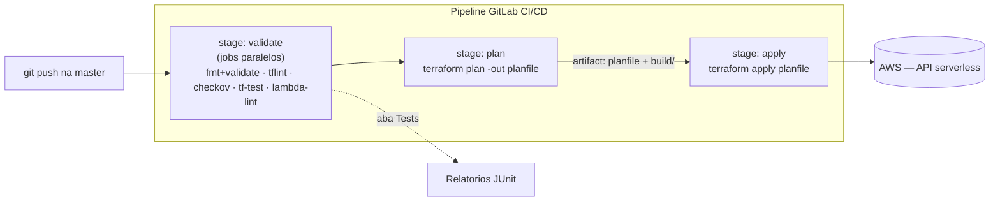

# 03.2 - Validando e gerando relatórios no pipeline

> **Terça-feira, 9h. No dia seguinte ao primeiro pipeline.**
> **Diego Tavares** passa na sua mesa com o café na mão:
>
> > *— "O pipeline de ontem ficou ótimo, subiu a API redonda. Mas tem um buraco: ele aplica qualquer coisa. Se alguém abrir um security group `0.0.0.0/0`, esquecer de tipar uma variável, ou colar um `handler.py` que nem importa direito, o pipeline aplica feliz da vida e a gente só descobre quando quebra. Eu quero **barrar config malfeita ou insegura ANTES do apply**. E quero ver um **relatório** de cada execução, não ter que ler log linha por linha."*
>
> Você lembra das ferramentas que o runner já tem instaladas (Ansible cuidou disso no módulo 02): `terraform fmt`/`validate`, **TFLint**, **Checkov** e o **terraform test**. Juntas, elas formam um gate de qualidade e segurança. Vamos adicioná-las como um novo stage que roda **antes** do `plan`.

Os comandos de terminal rodam no **Codespaces**. A leitura do pipeline e do relatório acontece no **console do GitLab**.

> [!WARNING]
> **Pré-requisitos obrigatórios antes de começar:**
>
> - [ ] **Lab 03.1 concluído** — você já tem um `.gitlab-ci.yml` funcional com os stages `plan` e `apply` no `primeiro-projeto`, e o pipeline subiu a API.
> - [ ] **GitLab Runner online** com a tag `shell` (módulo 02).
> - [ ] **Ferramentas de validação no runner** — `terraform`, **TFLint**, e o **Checkov** num virtualenv em `/opt/venv` (tudo provisionado via Ansible no módulo 02).
> - [ ] **Chave SSH do GitLab** carregada no Codespaces.
>
> **Valide rapidamente** que você está no projeto certo:
>
> ```bash
> cd /workspaces/FIAP-Platform-Engineering/02-Ansible/01-provisionando-gitlab-runner/primeiro-projeto && cat .gitlab-ci.yml
> ```
>
> Se o `.gitlab-ci.yml` do lab anterior aparecer, você está pronto.

Neste laboratório vamos evoluir o pipeline do lab 03.1. Adicionamos um stage `validate` **antes** do `plan` com **jobs paralelos**, cada um rodando uma verificação diferente: formatação e sintaxe (`terraform fmt`/`validate`), boas práticas (**TFLint**), segurança (**Checkov**), testes de infraestrutura (**terraform test**) e validação do código da Lambda. O Checkov e o TFLint geram **relatórios JUnit XML** que o GitLab exibe numa aba dedicada de **Tests** — transformando "config malfeita" num gate objetivo e visível.

## Principais pontos de aprendizagem

- adicionar um stage de validação **antes** do `plan`, com **jobs paralelos** no mesmo stage
- usar `terraform fmt -check` e `terraform validate` para formatação e sintaxe do HCL
- rodar o **TFLint** para pegar problemas de boas práticas que o `validate` não vê
- rodar o **Checkov** como gate de segurança de IaC
- escrever e rodar **`terraform test`** (testes nativos de infraestrutura)
- validar o **código da Lambda** (compilação Python) dentro do pipeline
- gerar e exportar relatórios **JUnit XML** e visualizá-los na aba **Tests** do GitLab

## O que você terá ao final

Um pipeline de 3 stages (`validate → plan → apply`) onde o `validate` roda **cinco jobs em paralelo** e publica relatórios de teste legíveis no GitLab. **Diego vai querer abrir a aba Tests e ver o resumo dos checks de cada execução** — esse é o entregável simbólico do lab.

> [!TIP]
> Sempre que encontrar um bloco com o título **💡 Clique para entender**, abra esse trecho. Ele traz a anatomia do comando, o contexto da aula e links oficiais.

## Mapa do lab

| Parte | O que você faz | Passos | Tempo |
|-------|----------------|--------|-------|
| [Parte 1](#parte-1---escrevendo-o-teste-de-infraestrutura) | Escrevendo o `terraform test` | [1](#passo-1) · [2](#passo-2) | ~10 min |
| [Parte 2](#parte-2---adicionando-o-stage-validate) | Adicionando o stage `validate` (jobs paralelos) | [3](#passo-3) · [4](#passo-4) | ~12 min |
| [Parte 3](#parte-3---disparando-o-pipeline) | Disparando o pipeline | [5](#passo-5) · [6](#passo-6) | ~5 min |
| [Parte 4](#parte-4---lendo-o-relatorio-de-testes) | Lendo o relatório de testes | [7](#passo-7) · [8](#passo-8) · [9](#passo-9) | ~10 min |
| [Parte 5](#parte-5---destruindo-a-infraestrutura) | Destruindo a API e o runner ao final | [10](#passo-10) · [11](#passo-11) | ~5 min |

> [!TIP]
> Se travou em algum passo, clique no número do passo na coluna **Passos** acima.

<details>
<summary><b>💡 O que são essas ferramentas, em uma frase cada</b></summary>
<blockquote>

- **`terraform fmt -check`** — verifica se o código está na formatação canônica (indentação, alinhamento). Não muda nada, só falha se estiver fora do padrão.
- **`terraform validate`** — checa que o HCL é sintaticamente válido e internamente consistente (referências, tipos).
- **[TFLint](https://github.com/terraform-linters/tflint)** — linter que pega problemas que o `validate` não vê: variáveis sem tipo, atributos depreciados, tipos de instância inválidos, regras de boas práticas AWS.
- **[Checkov](https://www.checkov.io/)** — scanner de segurança de IaC: avalia o código contra centenas de políticas (criptografia, exposição de portas, logs, etc.) **antes** de aplicar.
- **[terraform test](https://developer.hashicorp.com/terraform/language/tests)** — framework de teste nativo do Terraform (1.6+): roda um `plan` e faz *asserts* sobre os recursos planejados, sem criar nada na nuvem.

Documentação oficial:
- [Checkov — saída JUnit XML](https://www.checkov.io/2.Basics/Reviewing%20Scan%20Results.html)
- [Relatórios de teste JUnit no GitLab](https://docs.gitlab.com/ee/ci/testing/unit_test_reports.html)

</blockquote>
</details>

## Contexto

Por que adicionar um stage de validação em vez de confiar só no `plan`?

| Aspecto | Resposta curta |
|---------|----------------|
| **Problema de negócio** | O pipeline do 03.1 aplica qualquer coisa — config malfeita ou insegura chega à nuvem e só é descoberta depois. |
| **Pergunta que ele responde bem** | "Essa mudança está bem formatada, segue boas práticas, é segura e faz o que diz — antes de eu aplicar?" |
| **Pergunta que ele responde mal** | "Esse recurso está seguro em runtime?" (as ferramentas são estáticas, não testam o recurso já provisionado). |
| **Quando acontece na vida real** | Toda equipe que sofreu um incidente por config malfeita acaba colocando um gate de validação obrigatório no pipeline. |

O fluxo agora tem três stages encadeados — o `validate` é a primeira porta, e roda vários checks ao mesmo tempo:



---

## Parte 1 - Escrevendo o teste de infraestrutura

### Resultado esperado desta parte

Ao final desta etapa, o `primeiro-projeto` terá um arquivo de teste nativo do Terraform (`tests/api.tftest.hcl`) que valida os recursos da API sem criar nada na nuvem.

---

<a id="passo-1"></a>

**1.** Continuando no repositório `primeiro-projeto`, entre na pasta do projeto e crie a pasta de testes:

```bash
cd /workspaces/FIAP-Platform-Engineering/02-Ansible/01-provisionando-gitlab-runner/primeiro-projeto
mkdir -p tests
code tests/api.tftest.hcl
```

---

<a id="passo-2"></a>

**2.** Inclua o conteúdo abaixo no `tests/api.tftest.hcl`. Ele roda um `plan` e faz *asserts* sobre os recursos da API — uma forma de garantir que o código "faz o que dizemos que faz" sem precisar aplicar:

```hcl
run "valida_recursos_da_api" {
  command = plan

  assert {
    condition     = aws_dynamodb_table.scooters.billing_mode == "PAY_PER_REQUEST"
    error_message = "A tabela DynamoDB deve ser on-demand (PAY_PER_REQUEST) para ficar no free-tier."
  }

  assert {
    condition     = aws_lambda_function.api.runtime == "python3.12"
    error_message = "A Lambda deve usar o runtime python3.12."
  }

  assert {
    condition     = aws_lambda_function.api.environment[0].variables["TABLE_NAME"] == aws_dynamodb_table.scooters.name
    error_message = "A Lambda precisa receber o nome da tabela via variavel de ambiente TABLE_NAME."
  }

  assert {
    condition     = aws_apigatewayv2_api.http.protocol_type == "HTTP"
    error_message = "A API deve ser do tipo HTTP (apigatewayv2)."
  }

  assert {
    condition     = length(aws_apigatewayv2_route.routes) == 3
    error_message = "A API deve expor exatamente 3 rotas (lista, consulta e atualizacao)."
  }
}
```

<details>
<summary><b>💡 Clique para entender: terraform test</b></summary>
<blockquote>

O `terraform test` é o framework de teste nativo do Terraform (a partir da versão 1.6). Cada bloco `run` executa um `command` (aqui, `plan`) e verifica uma lista de `assert`. Se qualquer condição for falsa, o teste falha com a `error_message` correspondente.

Como usamos `command = plan`, **nada é criado na AWS** — o teste avalia o que o Terraform *planejaria* fazer. É barato, rápido e perfeito para um gate de CI: garante invariantes do seu código (a tabela é on-demand? a Lambda recebe a variável certa? o número de rotas está correto?) antes de qualquer `apply`.

Documentação oficial:
- [Terraform tests](https://developer.hashicorp.com/terraform/language/tests)

</blockquote>
</details>

### Checkpoint

Se você chegou até aqui, então:

- existe o arquivo `tests/api.tftest.hcl` no `primeiro-projeto`
- ele tem um bloco `run` com `command = plan` e cinco `assert`

---

## Parte 2 - Adicionando o stage validate

### Resultado esperado desta parte

Ao final desta etapa, o `.gitlab-ci.yml` terá três stages — `validate`, `plan` e `apply` — com **cinco jobs paralelos** no `validate`.

---

<a id="passo-3"></a>

**3.** Abra o `.gitlab-ci.yml` para evoluí-lo:

```bash
code .gitlab-ci.yml
```

---

<a id="passo-4"></a>

**4.** Substitua o conteúdo pelo exemplo abaixo. Adicionamos o stage `validate` **antes** do `plan`, com **cinco jobs que rodam em paralelo** (todos no mesmo stage). Dois deles — `checkov` e `tflint` — exportam relatório **JUnit XML** para a aba **Tests** do GitLab:

```yaml
---
stages:
  - validate
  - plan
  - apply

# ---------- STAGE validate: cinco checks em paralelo ----------

fmt-validate:
  stage: validate
  script:
    - terraform fmt -check -recursive
    - terraform init -backend=false
    - terraform validate
  tags:
    - shell

tflint:
  stage: validate
  script:
    - tflint --init
    - tflint --format junit > tflint-report.xml
  artifacts:
    when: always
    paths:
      - tflint-report.xml
    reports:
      junit: tflint-report.xml
  tags:
    - shell

checkov:
  stage: validate
  script:
    - source /opt/venv/bin/activate
    - checkov --directory . --framework terraform -o junitxml > checkov-report.xml || true
  artifacts:
    when: always
    paths:
      - checkov-report.xml
    reports:
      junit: checkov-report.xml
  tags:
    - shell

tf-test:
  stage: validate
  script:
    - terraform init -backend=false
    - terraform test
  tags:
    - shell

lambda-lint:
  stage: validate
  script:
    - python3 -m py_compile src/handler.py
  tags:
    - shell

# ---------- STAGE plan ----------

plan:
  stage: plan
  script:
    - terraform init
    - terraform plan -out "planfile"
  dependencies: []
  artifacts:
    paths:
      - planfile
      - build/
  tags:
    - shell

# ---------- STAGE apply ----------

apply:
  stage: apply
  script:
    - terraform init
    - terraform apply planfile
  dependencies:
    - plan
  tags:
    - shell
```

<details>
<summary><b>💡 Clique para entender: por que jobs paralelos e o que cada um faz</b></summary>
<blockquote>

No stage `validate`, os **cinco jobs pertencem ao mesmo stage**, então o GitLab os mostra lado a lado e só avança para o `plan` quando **todos** terminarem. Cada um cobre um ângulo:

- **`fmt-validate`** — `terraform fmt -check` (formatação canônica) + `terraform validate` (sintaxe/consistência). Usa `init -backend=false` porque não precisa do estado remoto só para validar.
- **`tflint`** — boas práticas que o `validate` não pega (variáveis sem tipo, atributos depreciados). Exporta JUnit.
- **`checkov`** — gate de segurança de IaC. Ativa o virtualenv onde o Ansible instalou o Checkov (`/opt/venv`) e exporta JUnit. O `|| true` evita que findings abortem o job — assim o relatório é sempre publicado (decisão didática; em produção você decidiria barrar em finding crítico).
- **`tf-test`** — roda o `tests/api.tftest.hcl` (asserts sobre o plan). `init -backend=false` porque o teste só planeja.
- **`lambda-lint`** — compila o `src/handler.py` com `py_compile`: pega erro de sintaxe Python no código da Lambda antes de empacotá-lo.

### Por que `dependencies: []` no plan

Como o `validate` tem vários jobs que geram artefatos (os relatórios), o `dependencies: []` no `plan` diz "não baixe artefato nenhum dos stages anteriores" — o `plan` não precisa dos relatórios, só do código. Sem isso, o GitLab tentaria baixar todos os artefatos do `validate`.

### Bloco artifacts/reports

- **`artifacts: paths: [...]`** guarda o XML como arquivo baixável.
- **`reports: junit: ...`** diz ao GitLab para **interpretar** o XML como relatório de testes e exibi-lo na aba **Tests** do pipeline.
- **`when: always`** garante que o relatório seja publicado mesmo se o job falhar.

Documentação oficial:
- [`terraform validate`](https://developer.hashicorp.com/terraform/cli/commands/validate)
- [TFLint](https://github.com/terraform-linters/tflint)
- [`artifacts:reports:junit`](https://docs.gitlab.com/ee/ci/yaml/artifacts_reports.html#artifactsreportsjunit)

</blockquote>
</details>

<details>
<summary><b>⚠ Se der erro: <code>checkov: command not found</code> no job checkov</b></summary>
<blockquote>

O virtualenv com o Checkov não foi ativado, ou o caminho `/opt/venv` não existe no runner:

- Confirme que o módulo 02 (Ansible) terminou de provisionar o runner com o Checkov dentro do venv em `/opt/venv`.
- Você pode validar manualmente conectando no EC2 do runner (via SSM) e rodando `source /opt/venv/bin/activate && checkov --version`.

</blockquote>
</details>

<details>
<summary><b>⚠ Se der erro: <code>tflint: command not found</code> no job tflint</b></summary>
<blockquote>

O TFLint não está instalado no runner. Ele é provisionado pelo playbook do módulo 02 (`tasks/tflint.yml`). Reaplique o playbook do módulo 02 no runner ou, para validar, conecte no EC2 via SSM e rode `tflint --version`.

</blockquote>
</details>

### Checkpoint

Se você chegou até aqui, então:

- o `.gitlab-ci.yml` tem três stages: `validate`, `plan`, `apply`
- o stage `validate` tem cinco jobs paralelos (`fmt-validate`, `tflint`, `checkov`, `tf-test`, `lambda-lint`)
- `checkov` e `tflint` exportam relatório JUnit

---

## Parte 3 - Disparando o pipeline

### Resultado esperado desta parte

Ao final desta etapa, o `push` na `master` terá disparado o pipeline com os 3 stages.

---

<a id="passo-5"></a>

**5.** Atualize o repositório do GitLab com os comandos abaixo:

```bash
git add .gitlab-ci.yml tests/api.tftest.hcl
git commit -m "pipeline com validacao"
eval $(ssh-agent -s)
ssh-add -k /home/vscode/.ssh/gitlab
git push origin master
```

<details>
<summary><b>⚠ Se der erro: <code>git@gitlab.com: Permission denied (publickey)</code></b></summary>
<blockquote>

A chave SSH não está carregada na sessão atual. Rode novamente os dois comandos do `ssh-agent`/`ssh-add` acima antes do `git push`.

</blockquote>
</details>

---

<a id="passo-6"></a>

**6.** Vá até os **Pipelines** do seu repositório e note que agora são **3 stages**, com o `validate` mostrando vários jobs lado a lado:


### Checkpoint

Se você chegou até aqui, então:

- o `push` foi aceito
- o pipeline mais recente mostra três stages (`validate`, `plan`, `apply`)
- o stage `validate` mostra os cinco jobs paralelos

---

## Parte 4 - Lendo o relatório de testes

### Resultado esperado desta parte

Ao final desta etapa, você terá lido o relatório gerado pelo Checkov e pelo TFLint na aba **Tests** do pipeline.

---

<a id="passo-7"></a>

**7.** Aguarde o pipeline terminar e clique na aba **Tests** do pipeline:


---

<a id="passo-8"></a>

**8.** Nessa tela, o GitLab mostra um resumo dos testes executados por essa execução. Clique numa das suítes (ex: a do Checkov) para detalhar:


---

<a id="passo-9"></a>

**9.** Cada linha corresponde a uma política avaliada contra o seu código. Repare que o relatório aponta **quais** checks passaram e falharam — esse é o material que você levaria para uma revisão de segurança, concreto e gerado automaticamente a cada push:


> [!TIP]
> O Checkov vai apontar alguns findings na Lambda (ex: X-Ray tracing desligado, code-signing ausente). Isso é **esperado** e didático: mostra que mesmo um código que funciona tem pontos de endurecimento de segurança. Em produção, você e o Diego decidiriam quais viram bloqueio do pipeline.

### Checkpoint

Se você chegou até aqui, então:

- o pipeline rodou os 3 stages
- a aba **Tests** mostra o resumo dos checks (Checkov e TFLint)
- você consegue detalhar os checks clicando numa suíte

---

## Parte 5 - Destruindo a infraestrutura

### Resultado esperado desta parte

Ao final desta etapa, a API serverless **e o runner** (a EC2 do módulo 02) terão sido destruídos, zerando o custo. Este é o **fim do arco** — agora é seguro destruir o runner, porque nenhum lab posterior depende mais dele.

> [!CAUTION]
> Só destrua o runner **aqui**, no fim do módulo 03. Se você tivesse destruído no fim do módulo 02, os pipelines deste módulo ficariam "stuck" (sem runner). Por isso o destroy do runner foi adiado até este ponto.

---

<a id="passo-10"></a>

**10.** Destrua a **API serverless** do `primeiro-projeto`. No terminal do Codespaces:

```bash
cd /workspaces/FIAP-Platform-Engineering/02-Ansible/01-provisionando-gitlab-runner/primeiro-projeto
terraform destroy -auto-approve
```

Deve terminar com `Destroy complete!`. Isso remove a Lambda, a API Gateway e a tabela DynamoDB.

---

<a id="passo-11"></a>

**11.** Destrua o **runner** (a EC2 provisionada no módulo 02):

```bash
cd /workspaces/FIAP-Platform-Engineering/02-Ansible/01-provisionando-gitlab-runner/terraform-gitlab-runner
terraform destroy -auto-approve
```

> [!CAUTION]
> **Destroy é obrigatório, não opcional.** A EC2 `t3.small` do runner fica **ligada e cobrando** (~$0,02/h) enquanto existir. Diferente de "pausar", o `destroy` **zera** o custo. O state remoto no S3 permanece e custa centavos. A rede `fiap-lab` é gratuita e pode ficar de pé.

### Checkpoint

- os dois `terraform destroy` terminaram com `Destroy complete!`
- a Lambda, a API Gateway, a tabela DynamoDB e a EC2 do runner não aparecem mais no console

---

## Conclusão

Neste laboratório você:

- escreveu um teste nativo de infraestrutura com **`terraform test`**
- adicionou um stage `validate` **antes** do `plan`, com **cinco jobs paralelos**
- rodou `terraform fmt`/`validate`, **TFLint**, **Checkov**, **terraform test** e validação do código da Lambda
- gerou e exportou relatórios em **JUnit XML**
- visualizou os relatórios na aba **Tests** do GitLab
- destruiu a API e o runner ao final, zerando o custo

**Mensagem para Diego**: agora a config passa por formatação, boas práticas, segurança e testes antes do `apply`, e cada execução deixa relatórios legíveis. Config malfeita é flagrada no pipeline, não na fatura. O pedido do começo do mês está completo: push → valida → planeja → aplica, tudo automático e auditável.

---

## Próximo passo

Você fechou o arco da Vortex Mobility: a infraestrutura virou código (módulo 01), o provisionamento virou playbook (módulo 02) e o deploy virou pipeline validado (módulo 03).

Prossiga para o **[Trabalho Final](../../Trabalho-final/README.md)** — onde você junta Terraform, Ansible e CI/CD para entregar a infraestrutura da Vortex de ponta a ponta.

---

<details>
<summary><b>💡 Glossário rápido — termos que aparecem neste lab</b></summary>
<blockquote>

| Termo | O que é |
|-------|---------|
| **`terraform fmt -check`** | Verifica se o código está na formatação canônica, sem alterá-lo. |
| **`terraform validate`** | Checa a sintaxe e a consistência interna do HCL, sem tocar na nuvem. |
| **TFLint** | Linter de Terraform: pega boas práticas e erros que o `validate` não vê. |
| **Checkov** | Scanner estático de segurança de IaC, avalia o código contra políticas. |
| **`terraform test`** | Framework de teste nativo: roda `plan` e faz asserts sobre os recursos. |
| **Job paralelo** | Vários jobs no mesmo stage rodam ao mesmo tempo; o stage só termina quando todos terminam. |
| **JUnit XML** | Formato padrão de relatório de testes que o GitLab renderiza na aba **Tests**. |
| **`artifacts:reports:junit`** | Chave do `.gitlab-ci.yml` que diz ao GitLab para exibir um XML como relatório de testes. |
| **Gate de validação** | Etapa do pipeline que precisa passar antes que a mudança avance — aqui, o stage `validate`. |

</blockquote>
</details>

<details>
<summary><b>💡 Como pedir ajuda se travou</b></summary>
<blockquote>

Antes de abrir issue, colete estas 4 informações — elas reduzem o tempo de resposta em 10×:

1. **Em que passo você está** (ex: "passo 4, no job `checkov`")
2. **Mensagem de erro literal** (copie o texto do log do GitLab — texto, não screenshot)
3. **Qual job do `validate` falhou** (`fmt-validate`, `tflint`, `checkov`, `tf-test` ou `lambda-lint`)
4. **O que você já tentou**

Canais (em ordem de prioridade):

- **Issues do repositório**: [github.com/vamperst/FIAP-Platform-Engineering/issues](https://github.com/vamperst/FIAP-Platform-Engineering/issues)
- **E-mail do professor**: `Rafael@rfbarbosa.com`
- **LinkedIn**: [rafael-barbosa-serverless](https://www.linkedin.com/in/rafael-barbosa-serverless/)
- **Antes de tudo**: a maioria dos erros é o venv do Checkov ou o TFLint não estarem no runner. Confira que o módulo 02 terminou de provisionar o runner.

</blockquote>
</details>
